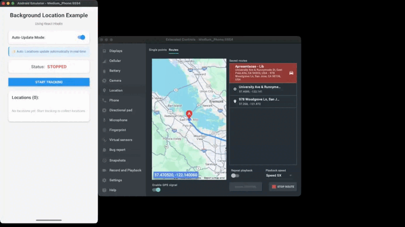

# @gabriel-sisjr/react-native-background-location

[](https://www.npmjs.com/package/@gabriel-sisjr/react-native-background-location)
[](https://www.npmjs.com/package/@gabriel-sisjr/react-native-background-location/v/beta)
[](https://www.npmjs.com/package/@gabriel-sisjr/react-native-background-location)
[](https://www.npmjs.com/package/@gabriel-sisjr/react-native-background-location)
[](https://github.com/gabriel-sisjr/react-native-background-location/actions/workflows/ci.yml)
[](https://codecov.io/gh/gabriel-sisjr/react-native-background-location)
[](https://github.com/gabriel-sisjr/react-native-background-location/actions/workflows/prerelease.yml)
[](https://github.com/gabriel-sisjr/react-native-background-location/actions/workflows/publish.yml)
[](https://github.com/gabriel-sisjr/react-native-background-location/stargazers)
[](https://github.com/gabriel-sisjr/react-native-background-location/blob/develop/LICENSE)
[

](https://bundlephobia.com/package/@gabriel-sisjr/react-native-background-location)


A React Native library for tracking location in the background using TurboModules (New Architecture). Track user location even when the app is minimized or in the background.



## Features

- ✅ **Background location tracking** - Continues tracking when app is in background
- ✅ **Real-time location updates** - Automatic event-driven location watching
- ✅ **Crash recovery** - Automatic recovery of tracking sessions after app crash or restart
- ✅ **Battery optimization** - Configurable accuracy levels and update intervals for efficient battery usage
- ✅ **TurboModule** - Built with React Native's New Architecture for better performance
- ✅ **Session-based tracking** - Organize location data by trip/session IDs
- ✅ **TypeScript support** - Fully typed API
- ✅ **Android support** - Native Kotlin implementation (iOS coming soon)
- ✅ **Persistent storage** - Locations are stored in Room Database and survive app restarts
- ✅ **Foreground service** - Uses Android foreground service for reliable tracking
- ✅ **Notification customization** - Custom icons, colors, action buttons, dynamic updates, and more

## Installation

```sh
npm install @gabriel-sisjr/react-native-background-location
# or
yarn add @gabriel-sisjr/react-native-background-location
```

## Platform Configuration

### Android

#### 1. Add Permissions to AndroidManifest.xml

Edit `android/app/src/main/AndroidManifest.xml`:

```xml
<manifest xmlns:android="http://schemas.android.com/apk/res/android">

  <!-- Location permissions -->
  <uses-permission android:name="android.permission.ACCESS_FINE_LOCATION" />
  <uses-permission android:name="android.permission.ACCESS_COARSE_LOCATION" />

  <!-- Background location for Android 10+ -->
  <uses-permission android:name="android.permission.ACCESS_BACKGROUND_LOCATION" />

  <!-- Foreground service permissions -->
  <uses-permission android:name="android.permission.FOREGROUND_SERVICE" />
  <uses-permission android:name="android.permission.FOREGROUND_SERVICE_LOCATION" />

  <application>
    <!-- Your app configuration -->
  </application>
</manifest>
```

#### 2. Request Permissions (Critical for Android 11+)

> **⚠️ IMPORTANT:** On Android 11 (API 30) and higher, you **MUST** request background location permission **separately** from foreground permissions. Requesting them together will **silently fail**.

```typescript
import { PermissionsAndroid, Platform, Alert } from 'react-native';

async function requestLocationPermissions(): Promise<boolean> {
  if (Platform.OS !== 'android') {
    return true;
  }

  try {
    // Step 1: Request foreground permissions FIRST
    const foregroundPermissions = await PermissionsAndroid.requestMultiple([
      PermissionsAndroid.PERMISSIONS.ACCESS_FINE_LOCATION,
      PermissionsAndroid.PERMISSIONS.ACCESS_COARSE_LOCATION,
    ]);

    const foregroundGranted =
      foregroundPermissions['android.permission.ACCESS_FINE_LOCATION'] === 'granted' ||
      foregroundPermissions['android.permission.ACCESS_COARSE_LOCATION'] === 'granted';

    if (!foregroundGranted) {
      return false;
    }

    // Step 2: For Android 10+, request background permission SEPARATELY
    // On Android 11+, this MUST be a separate request with user education
    if (Platform.Version >= 29) {
      // Show rationale before requesting (required for good UX and Play Store compliance)
      await new Promise<void>((resolve) => {
        Alert.alert(
          'Background Location Required',
          'To track your location when the app is in the background, please select "Allow all the time" on the next screen.',
          [{ text: 'Continue', onPress: () => resolve() }]
        );
      });

      const backgroundPermission = await PermissionsAndroid.request(
        PermissionsAndroid.PERMISSIONS.ACCESS_BACKGROUND_LOCATION
      );

      return backgroundPermission === 'granted';
    }

    return true;
  } catch (error) {
    console.error('Permission request failed:', error);
    return false;
  }
}
```

**Why this matters:**
- Android 11+ requires a two-step permission flow
- The system shows different UI for background location
- Requesting all permissions together silently fails for background
- Users must explicitly choose "Allow all the time" in system settings

### iOS

iOS support is not yet available. For cross-platform apps, consider:

- Using this library for Android with platform-specific code
- Using [`react-native-geolocation-service`](https://github.com/Agontuk/react-native-geolocation-service) or [`expo-location`](https://docs.expo.dev/versions/latest/sdk/location/) for iOS
- Abstracting location calls behind a wrapper service

The iOS implementation (when available) will maintain API compatibility with the current TypeScript interface.

## Usage

### Using React Hooks (Recommended)

The easiest way to use the library is with React Hooks:

```typescript
import {
  useLocationPermissions,
  useBackgroundLocation,
  useLocationUpdates,
  LocationAccuracy,
  NotificationPriority,
  type TrackingOptions,
} from '@gabriel-sisjr/react-native-background-location';

function TrackingScreen() {
  // Manage permissions
  const { permissionStatus, requestPermissions } = useLocationPermissions();

  // Configure tracking options
  const trackingOptions: TrackingOptions = {
    updateInterval: 5000, // 5 seconds
    fastestInterval: 3000, // 3 seconds
    maxWaitTime: 10000, // 10 seconds
    accuracy: LocationAccuracy.HIGH_ACCURACY,
    waitForAccurateLocation: false,
    notificationTitle: 'Location Tracking',
    notificationText: 'Tracking your location in background',
    notificationPriority: NotificationPriority.LOW,
  };

  // Manage tracking (for start/stop control)
  const {
    startTracking,
    stopTracking,
    isTracking,
  } = useBackgroundLocation({
    onError: (err) => console.error(err),
  });

  // Watch real-time location updates
  const {
    locations,
    lastLocation,
  } = useLocationUpdates({
    onLocationUpdate: (location) => {
      console.log('New location:', location);
    },
  });

  // Request permissions first
  if (!permissionStatus.hasPermission) {
    return <Button title="Grant Permissions" onPress={requestPermissions} />;
  }

  const handleStartTracking = () => {
    startTracking(undefined, trackingOptions);
  };

  return (
    <View>
      <Text>Status: {isTracking ? 'Tracking' : 'Stopped'}</Text>
      <Text>Locations: {locations.length}</Text>
      {lastLocation && (
        <>
          <Text>Last: {lastLocation.latitude}, {lastLocation.longitude}</Text>
          {lastLocation.accuracy !== undefined && (
            <Text>Accuracy: {lastLocation.accuracy.toFixed(2)} m</Text>
          )}
          {lastLocation.speed !== undefined && (
            <Text>Speed: {(lastLocation.speed * 3.6).toFixed(2)} km/h</Text>
          )}
        </>
      )}
      <Button
        title={isTracking ? 'Stop' : 'Start'}
        onPress={isTracking ? stopTracking : handleStartTracking}
      />
    </View>
  );
}
```

#### Real-Time Updates Hook

The `useLocationUpdates` hook provides automatic, real-time location updates:

```typescript
import { useLocationUpdates } from '@gabriel-sisjr/react-native-background-location';

function LiveTrackingScreen() {
  const {
    locations,
    lastLocation,
    isTracking,
    tripId,
    error,
  } = useLocationUpdates({
    onLocationUpdate: (location) => {
      console.log('New location received:', location);
    },
  });

  return (
    <View>
      <Text>Locations: {locations.length}</Text>
      {lastLocation && (
        <>
          <Text>Last: {lastLocation.latitude}, {lastLocation.longitude}</Text>
          {lastLocation.accuracy !== undefined && (
            <Text>Accuracy: {lastLocation.accuracy.toFixed(2)} m</Text>
          )}
          {lastLocation.speed !== undefined && (
            <Text>Speed: {(lastLocation.speed * 3.6).toFixed(2)} km/h</Text>
          )}
        </>
      )}
    </View>
  );
}
```

#### Callback Throttling (v0.8.0+)

The `onUpdateInterval` option allows you to throttle callback execution while still collecting all location updates:

```typescript
// Throttle callback for server sync (locations still collected at updateInterval)
useLocationUpdates({
  onLocationUpdate: (location) => {
    // This callback is called at most every 30 seconds
    syncToServer(location);
  },
  onUpdateInterval: 30000, // Sync every 30 seconds max
});

// Combine with distance filter for maximum efficiency
const trackingOptions: TrackingOptions = {
  distanceFilter: 50, // Only update if moved 50+ meters
  updateInterval: 5000, // Check every 5 seconds
};

await BackgroundLocation.startTracking(trackingOptions);

useLocationUpdates({
  onLocationUpdate: (location) => {
    // Called when device moves 50+ meters AND at most every 60 seconds
    uploadToServer(location);
  },
  onUpdateInterval: 60000, // Upload at most every 60 seconds
});
```

**Key differences:**
- `distanceFilter` (TrackingOptions): Filters location collection at the native level
- `onUpdateInterval` (useLocationUpdates): Throttles callback execution but locations are still collected
- Combine both for optimal battery life and network efficiency

#### Notification Customization (v0.9.0+)

Customize the foreground service notification appearance:

```typescript
await BackgroundLocation.startTracking('trip-123', {
  // Visual customization
  notificationSmallIcon: 'ic_delivery',     // Custom drawable resource
  notificationColor: '#FF5722',              // Accent color
  notificationShowTimestamp: true,            // Show time
  notificationLargeIcon: 'ic_large_logo',    // Large icon
  notificationSubtext: '2.5km remaining',    // Subtext
  notificationChannelId: 'delivery_channel', // Custom channel

  // Action buttons (max 3)
  notificationActions: [
    { id: 'stop', label: 'Stop Tracking' },
    { id: 'emergency', label: 'Emergency' },
  ],
});

// Update notification content dynamically
await BackgroundLocation.updateNotification(
  'Delivery #1234',
  'Arriving in 5 minutes'
);

// Listen for action button presses
useLocationUpdates({
  onNotificationAction: (event) => {
    if (event.actionId === 'stop') {
      BackgroundLocation.stopTracking();
    }
  },
});
```

**Important notes:**
- Custom icons must be valid drawable resources in your app's `res/drawable/` directory
- Invalid icon names or colors fall back to defaults with a warning log
- `updateNotification()` changes are transient — they don't survive service restarts
- The minimal notification (shown during the 5-10s Android startup deadline) is not affected

### Static Notification Defaults

You can set default notification icons and colors without passing them on every `startTracking()` call. These defaults also apply to the minimal notification (Android 12+ startup deadline) and the crash recovery notification — contexts where runtime options are not yet available.

#### Option 1: AndroidManifest Metadata (Recommended)

Add `<meta-data>` elements to your app's `AndroidManifest.xml`, following the same pattern used by Firebase:

```xml
<application>
    <!-- Default small icon for all tracking notifications -->
    <meta-data
        android:name="com.backgroundlocation.default_notification_icon"
        android:resource="@drawable/ic_notification" />

    <!-- Default large icon (optional) -->
    <meta-data
        android:name="com.backgroundlocation.default_notification_large_icon"
        android:resource="@drawable/ic_logo_large" />

    <!-- Default accent color (optional) -->
    <meta-data
        android:name="com.backgroundlocation.default_notification_color"
        android:resource="@color/notification_accent" />
</application>
```

#### Option 2: Convention-Based Drawable

Simply place a drawable with a specific name in your app's `res/drawable/` directory — no configuration needed:

- **Small icon:** `bg_location_notification_icon` (e.g., `res/drawable/bg_location_notification_icon.xml`)
- **Large icon:** `bg_location_notification_large_icon`

#### Resolution Priority

Icons and colors are resolved in this order (highest priority first):

1. **Runtime** — `TrackingOptions.notificationSmallIcon` passed to `startTracking()`
2. **AndroidManifest** — `<meta-data>` elements
3. **Convention** — Drawables with conventional names
4. **System default** — `android.R.drawable.ic_menu_mylocation`

This means runtime options always win, but if omitted, the library automatically falls back through the chain. The minimal notification and crash recovery notification — which run before/without JS — benefit from options 2-4.

See the [Hooks Guide](docs/getting-started/hooks.md) for complete hook documentation.
See the [Real-Time Updates Guide](docs/getting-started/REAL_TIME_UPDATES.md) for real-time location watching.

### Using Direct API

You can also use the module API directly:

```typescript
import BackgroundLocation, {
  type Coords,
  LocationAccuracy,
  NotificationPriority,
  type TrackingOptions,
} from '@gabriel-sisjr/react-native-background-location';

// Configure tracking options
const options: TrackingOptions = {
  updateInterval: 5000,
  fastestInterval: 3000,
  maxWaitTime: 10000,
  accuracy: LocationAccuracy.HIGH_ACCURACY,
  waitForAccurateLocation: false,
  notificationTitle: 'Location Tracking',
  notificationText: 'Tracking your location in background',
  notificationPriority: NotificationPriority.LOW,
};

// Recommended: Let the library generate a unique trip ID
const tripId = await BackgroundLocation.startTracking(undefined, options);

// Optional: Resume tracking with an existing trip ID (for crash recovery)
// Only use this to resume a previously interrupted tracking session
const resumedTripId =
  await BackgroundLocation.startTracking('existing-trip-123', options);

// Check if tracking is active
const status = await BackgroundLocation.isTracking();
console.log(status.active); // true/false
console.log(status.tripId); // current trip ID if active

// Get all locations for a trip
const locations: Coords[] = await BackgroundLocation.getLocations(tripId);
locations.forEach((location) => {
  console.log(location.latitude); // string
  console.log(location.longitude); // string
  console.log(location.timestamp); // number (Unix timestamp in ms)
  
  // Extended properties (optional, check for undefined)
  if (location.accuracy !== undefined) {
    console.log(`Accuracy: ${location.accuracy} meters`);
  }
  if (location.speed !== undefined) {
    console.log(`Speed: ${location.speed} m/s`);
  }
  if (location.altitude !== undefined) {
    console.log(`Altitude: ${location.altitude} meters`);
  }
  // ... and more properties available
});

// Stop tracking
await BackgroundLocation.stopTracking();

// Clear stored data for a trip
await BackgroundLocation.clearTrip(tripId);
```

## API Reference

### `startTracking()`

Starts location tracking in background for a new or existing trip.

**Overload 1: Options only (tripId auto-generated)**
```typescript
startTracking(options?: TrackingOptions): Promise<string>
```

**Overload 2: With tripId**
```typescript
startTracking(tripId?: string, options?: TrackingOptions): Promise<string>
```

- **Parameters:**
  - `tripId` (optional): Existing trip identifier to resume tracking. If omitted, a new UUID will be generated.

    **⚠️ Important:** Only provide a `tripId` when resuming an interrupted tracking session (e.g., after app crash, battery drain, etc.). For new trips, always omit this parameter to let the library generate a unique UUID. This prevents data overwriting and ensures each trip has a unique identifier.

  - `options` (optional): Configuration options for location tracking. See [TrackingOptions](#trackingoptions) for details.

- **Returns:** Promise resolving to the effective trip ID being used.

- **Behavior:**
  - If tracking is already active, returns the current trip ID (idempotent).
  - Starts a foreground service on Android with a persistent notification.
  - Requires location permissions to be granted.
  - **New trips:** Generates a unique UUID to prevent collisions.
  - **Resuming trips:** Continues collecting locations to the existing trip data.
  - Uses provided `options` or defaults if not specified.

- **Best Practice:**

  ```typescript
  // ✅ Good: Start a new trip with default options
  const newTripId = await startTracking();

  // ✅ Good: Start a new trip with custom options
  const customTripId = await startTracking(undefined, {
    accuracy: LocationAccuracy.HIGH_ACCURACY,
    updateInterval: 2000,
  });

  // ✅ Good: Resume after interruption
  const resumedTripId = await startTracking(previousTripId);

  // ❌ Avoid: Don't create new trips with custom IDs
  const badTripId = await startTracking('my-custom-id');
  ```

- **Throws:**
  - `PERMISSION_DENIED` if location permissions are not granted.
  - `START_TRACKING_ERROR` if unable to start the service.

### `stopTracking(): Promise<void>`

Stops all location tracking and terminates the background service.

- **Returns:** Promise that resolves when tracking is stopped.

- **Behavior:**
  - Removes the foreground service and notification.
  - Does not clear stored location data (use `clearTrip()` for that).

### `isTracking(): Promise<TrackingStatus>`

Checks if location tracking is currently active.

- **Returns:** Promise resolving to an object:
  ```typescript
  {
    active: boolean;      // Whether tracking is active
    tripId?: string;      // Current trip ID if tracking
  }
  ```

### `getLocations(tripId: string): Promise<Coords[]>`

Retrieves all stored location points for a specific trip.

- **Parameters:**
  - `tripId`: The trip identifier.

- **Returns:** Promise resolving to array of location coordinates with extended properties:

  ```typescript
  {
    latitude: string; // Latitude as string
    longitude: string; // Longitude as string
    timestamp: number; // Unix timestamp in milliseconds
    // Extended properties (optional, available when provided by location provider)
    accuracy?: number; // Horizontal accuracy in meters
    altitude?: number; // Altitude in meters above sea level
    speed?: number; // Speed in meters per second
    bearing?: number; // Bearing in degrees (0-360)
    verticalAccuracyMeters?: number; // Vertical accuracy (Android API 26+)
    speedAccuracyMetersPerSecond?: number; // Speed accuracy (Android API 26+)
    bearingAccuracyDegrees?: number; // Bearing accuracy (Android API 26+)
    elapsedRealtimeNanos?: number; // Elapsed realtime in nanoseconds
    provider?: string; // Location provider (gps, network, passive, etc.)
    isFromMockProvider?: boolean; // Whether from mock provider (Android API 18+)
  }[];
  ```

- **Throws:**
  - `INVALID_TRIP_ID` if trip ID is empty.
  - `GET_LOCATIONS_ERROR` if unable to retrieve data.

### `clearTrip(tripId: string): Promise<void>`

Clears all stored location data for a specific trip.

- **Parameters:**
  - `tripId`: The trip identifier to clear.

- **Returns:** Promise that resolves when data is cleared.

- **Throws:**
  - `INVALID_TRIP_ID` if trip ID is empty.
  - `CLEAR_TRIP_ERROR` if unable to clear data.

### `updateNotification(title: string, text: string): Promise<void>`

Updates the notification content while tracking is active. Dynamic updates are transient and do not persist across service restarts.

- **Parameters:**
  - `title`: New notification title
  - `text`: New notification text

- **Returns:** Promise that resolves when notification is updated.

- **Behavior:**
  - Inherits icon, color, and timestamp settings from initial tracking options
  - Does not recreate the notification channel
  - Updates are transient (not persisted to database)

- **Throws:**
  - `INVALID_ARGUMENTS` if title or text is empty
  - `NO_ACTIVE_SERVICE` if no tracking is currently active

## Types

```typescript
interface Coords {
  latitude: string; // Latitude in decimal degrees
  longitude: string; // Longitude in decimal degrees
  timestamp: number; // Timestamp in milliseconds since Unix epoch
  
  // Extended location properties (optional, available when provided by location provider)
  accuracy?: number; // Horizontal accuracy in meters
  altitude?: number; // Altitude in meters above sea level
  speed?: number; // Speed in meters per second
  bearing?: number; // Bearing in degrees (0-360)
  verticalAccuracyMeters?: number; // Vertical accuracy in meters (Android API 26+)
  speedAccuracyMetersPerSecond?: number; // Speed accuracy in meters per second (Android API 26+)
  bearingAccuracyDegrees?: number; // Bearing accuracy in degrees (Android API 26+)
  elapsedRealtimeNanos?: number; // Elapsed realtime in nanoseconds since system boot
  provider?: string; // Location provider (gps, network, passive, etc.)
  isFromMockProvider?: boolean; // Whether the location is from a mock provider (Android API 18+)
}

interface TrackingStatus {
  active: boolean;
  tripId?: string;
}

interface TrackingOptions {
  updateInterval?: number; // Interval between location updates in milliseconds (default: 5000)
  fastestInterval?: number; // Fastest interval between location updates in milliseconds (default: 3000)
  maxWaitTime?: number; // Maximum wait time in milliseconds before delivering location updates (default: 10000)
  accuracy?: LocationAccuracy; // Location accuracy priority (default: LocationAccuracy.HIGH_ACCURACY)
  waitForAccurateLocation?: boolean; // Whether to wait for accurate location before delivering updates (default: false)
  distanceFilter?: number; // Minimum distance in meters between location updates (default: 0) - Android only
  onUpdateInterval?: number; // Throttle callback execution in milliseconds - locations still collected but callbacks limited (default: undefined)
  notificationTitle?: string; // Notification title for foreground service (default: "Location Tracking")
  notificationText?: string; // Notification text for foreground service (default: "Tracking your location in background")
  notificationChannelName?: string; // Notification channel name (Android) (default: "Background Location")
  notificationPriority?: NotificationPriority; // Notification priority (Android) (default: NotificationPriority.LOW)
  foregroundOnly?: boolean; // Track only while app is visible (default: false) - does not require background permission
  notificationSmallIcon?: string; // Custom drawable resource name for small icon. Falls back to manifest metadata, then convention drawable, then system default - Android only
  notificationColor?: string; // Hex color string for notification accent (e.g., "#FF5722") - Android only
  notificationShowTimestamp?: boolean; // Show timestamp on notification (default: false) - Android only
  notificationActions?: NotificationAction[]; // Up to 3 action buttons on notification - Android only
  notificationLargeIcon?: string; // Custom drawable for large icon - Android only
  notificationSubtext?: string; // Subtext below notification content - Android only
  notificationChannelId?: string; // Custom notification channel ID (default: "background_location_channel") - Android only
}

interface NotificationAction {
  id: string; // Unique action identifier
  label: string; // Button label text
}

interface NotificationActionEvent {
  tripId: string; // Active trip ID
  actionId: string; // ID of pressed action
}
```

## Enums

### LocationAccuracy

Location accuracy priority levels:

```typescript
enum LocationAccuracy {
  HIGH_ACCURACY = 'HIGH_ACCURACY', // Highest accuracy - uses GPS and other sensors (default)
  BALANCED_POWER_ACCURACY = 'BALANCED_POWER_ACCURACY', // Balanced accuracy and power consumption
  LOW_POWER = 'LOW_POWER', // Low power consumption - uses network-based location
  NO_POWER = 'NO_POWER', // No power consumption - only receives location updates when other apps request them
  PASSIVE = 'PASSIVE', // Passive location updates - receives location updates from other apps
}
```

### NotificationPriority

Notification priority levels for Android:

```typescript
enum NotificationPriority {
  LOW = 'LOW', // Low priority - minimal notification (default)
  DEFAULT = 'DEFAULT', // Default priority
  HIGH = 'HIGH', // High priority - more prominent notification
  MAX = 'MAX', // Maximum priority - urgent notification
}
```

### LocationPermissionStatus

Location permission status:

```typescript
enum LocationPermissionStatus {
  GRANTED = 'granted',
  DENIED = 'denied',
  BLOCKED = 'blocked',
  UNDETERMINED = 'undetermined',
}
```

## Configuration

The library provides configurable tracking options through `TrackingOptions`. You can customize location update intervals, accuracy, and notification settings.

### Default Configuration

The library uses the following default settings:

- **Update interval:** 5 seconds (5000ms)
- **Fastest interval:** 3 seconds (3000ms)
- **Max wait time:** 10 seconds (10000ms)
- **Accuracy:** `LocationAccuracy.HIGH_ACCURACY`
- **Wait for accurate location:** `false`
- **Notification title:** "Location Tracking"
- **Notification text:** "Tracking your location in background"
- **Notification channel name:** "Background Location"
- **Notification priority:** `NotificationPriority.LOW`
- **Notification icon:** Resolved via manifest metadata → convention drawable → system default

### Customizing Configuration

You can customize tracking options when starting tracking:

```typescript
import {
  BackgroundLocation,
  LocationAccuracy,
  NotificationPriority,
  type TrackingOptions,
} from '@gabriel-sisjr/react-native-background-location';

// High accuracy preset (for navigation)
const highAccuracyOptions: TrackingOptions = {
  updateInterval: 2000,
  fastestInterval: 1000,
  maxWaitTime: 5000,
  accuracy: LocationAccuracy.HIGH_ACCURACY,
  waitForAccurateLocation: true,
  notificationTitle: 'High Accuracy Tracking',
  notificationText: 'Using GPS for precise location tracking',
  notificationPriority: NotificationPriority.DEFAULT,
};

// Balanced preset (for most tracking use cases)
const balancedOptions: TrackingOptions = {
  updateInterval: 10000,
  fastestInterval: 5000,
  maxWaitTime: 15000,
  accuracy: LocationAccuracy.BALANCED_POWER_ACCURACY,
  waitForAccurateLocation: false,
  notificationPriority: NotificationPriority.LOW,
};

// Low power preset (for battery efficiency)
const lowPowerOptions: TrackingOptions = {
  updateInterval: 30000,
  fastestInterval: 15000,
  maxWaitTime: 60000,
  accuracy: LocationAccuracy.LOW_POWER,
  waitForAccurateLocation: false,
  notificationTitle: 'Low Power Tracking',
  notificationText: 'Power-efficient location tracking',
  notificationPriority: NotificationPriority.LOW,
};

// Distance filter for battery efficiency (v0.8.0+)
const distanceFilterOptions: TrackingOptions = {
  distanceFilter: 50, // Only update if moved 50+ meters
  accuracy: LocationAccuracy.HIGH_ACCURACY,
  updateInterval: 5000,
  notificationTitle: 'Efficient Tracking',
  notificationText: 'Tracking significant location changes',
};

// Start tracking with custom options
const tripId = await BackgroundLocation.startTracking(undefined, highAccuracyOptions);

// Start tracking with distance filter (new overload)
const filteredTripId = await BackgroundLocation.startTracking(distanceFilterOptions);
```

### Configuration Presets

The example app includes predefined configuration presets that you can use as a reference:

- **High Accuracy:** Optimized for navigation and precise tracking (2s interval, GPS)
- **Balanced:** Good balance between accuracy and battery (10s interval, balanced accuracy)
- **Low Power:** Optimized for battery efficiency (30s interval, network-based)

See the [example app](example/src/App.tsx) for complete implementation examples.

## Foreground-Only Mode

For apps that don't need background tracking or when background permission is denied, you can use foreground-only mode:

```typescript
const tripId = await BackgroundLocation.startTracking(undefined, {
  foregroundOnly: true,
  // Other options...
});
```

**When to use:**
- Privacy-focused apps where users prefer not to grant background permission
- Development and testing without background permission setup
- Fallback when background permission is denied
- Apps that only need tracking while actively used

**Behavior:**
- Tracking only works while the app is in foreground or visible
- Does not require `ACCESS_BACKGROUND_LOCATION` permission
- Foreground service still runs (with notification) for reliability
- Tracking pauses when app goes to background

## Crash Recovery & Session Persistence

The library automatically persists tracking state and location data. Here's how to handle app restarts and crashes:

### How It Works

1. **Tracking state** is stored in SharedPreferences and survives app restarts
2. **Location data** is stored in Room database and persists across sessions
3. **Foreground service** continues running briefly after app crash (until system kills it)

### Resuming After App Restart

Always check for active sessions when your app starts:

```typescript
import { useEffect, useState } from 'react';
import BackgroundLocation from '@gabriel-sisjr/react-native-background-location';

function App() {
  const [tripId, setTripId] = useState<string | null>(null);

  useEffect(() => {
    const checkActiveSession = async () => {
      const status = await BackgroundLocation.isTracking();

      if (status.active && status.tripId) {
        // Active session found - the service is still running
        console.log('Resuming active session:', status.tripId);
        setTripId(status.tripId);
      } else if (status.tripId && !status.active) {
        // Trip ID exists but service stopped (crash/kill scenario)
        // Option 1: Resume tracking
        const resumedId = await BackgroundLocation.startTracking(status.tripId);
        setTripId(resumedId);

        // Option 2: Just recover the data
        const locations = await BackgroundLocation.getLocations(status.tripId);
        console.log('Recovered locations:', locations.length);
      }
    };

    checkActiveSession();
  }, []);

  // ... rest of your app
}
```

### Best Practices

1. **Always check on startup**: Call `isTracking()` when your app initializes
2. **Persist tripId externally**: Store the tripId in your app's state management or AsyncStorage
3. **Handle orphaned data**: Decide whether to resume tracking or just recover locations
4. **Clean up old trips**: Call `clearTrip()` after uploading data to your server

## Coordinate Format

> **Note:** Coordinates (`latitude`, `longitude`) are returned as **strings**, not numbers.

This design choice preserves maximum precision without floating-point rounding issues. Always parse when using with map libraries:

```typescript
// ✅ Correct: Parse coordinates for map libraries
<Marker
  coordinate={{
    latitude: parseFloat(location.latitude),
    longitude: parseFloat(location.longitude),
  }}
/>

// ✅ Helper function for convenience
const toNumericCoords = (loc: Coords) => ({
  latitude: parseFloat(loc.latitude),
  longitude: parseFloat(loc.longitude),
});

// Usage with react-native-maps
<Polyline coordinates={locations.map(toNumericCoords)} />

// ❌ Wrong: Using strings directly will cause errors
<Marker coordinate={{ latitude: location.latitude, longitude: location.longitude }} />
```

## Memory Management

The `locations` array grows with each collected point. For long tracking sessions, implement these strategies:

### Memory Considerations

- **Typical memory usage**: ~500 bytes per location point
- **1-hour trip at 5s intervals**: ~720 points ≈ 360KB
- **8-hour trip at 5s intervals**: ~5,760 points ≈ 2.8MB

### Strategies for Long Trips

```typescript
// Strategy 1: Upload and clear periodically
const UPLOAD_THRESHOLD = 100; // Upload every 100 points

useLocationUpdates({
  onLocationUpdate: async (location) => {
    const locations = await BackgroundLocation.getLocations(tripId);

    if (locations.length >= UPLOAD_THRESHOLD) {
      await uploadToServer(tripId, locations);
      await BackgroundLocation.clearTrip(tripId);
      // Tracking continues with fresh storage
    }
  },
});

// Strategy 2: Display only recent locations
function LocationList({ locations }: { locations: Coords[] }) {
  const recentLocations = locations.slice(-50); // Show last 50 only

  return (
    <FlatList
      data={recentLocations}
      renderItem={({ item }) => <LocationItem location={item} />}
    />
  );
}

// Strategy 3: Virtualized list for all locations
import { FlashList } from '@shopify/flash-list';

function AllLocations({ locations }: { locations: Coords[] }) {
  return (
    <FlashList
      data={locations}
      renderItem={({ item }) => <LocationItem location={item} />}
      estimatedItemSize={80}
    />
  );
}
```

## Battery Optimization

The library includes built-in battery optimization features:

- **Configurable accuracy levels** - Use `LocationAccuracy.LOW_POWER` or `BALANCED_POWER_ACCURACY` for better battery efficiency
- **Adjustable update intervals** - Increase intervals to reduce battery consumption
- **Smart location updates** - Only requests location when necessary
- **Foreground service optimization** - Efficient service implementation

### Best Practices

- Use `LocationAccuracy.LOW_POWER` for long-term tracking
- Increase `updateInterval` when high-frequency updates aren't needed
- Stop tracking when not in use
- Inform users about battery usage
- Test on real devices (emulator GPS simulation is unreliable)

### Android Manufacturer-Specific Battery Optimization

Many Android manufacturers implement aggressive battery optimization that can kill background services. This is **not a library bug** but a platform behavior.

**Affected manufacturers:**
- **Xiaomi (MIUI)**: Auto-start permissions, battery saver
- **Huawei (EMUI/HarmonyOS)**: App launch management, power-intensive prompt
- **Samsung (OneUI)**: Sleeping apps, deep sleeping apps
- **Oppo (ColorOS)**: Battery optimization, auto-start
- **Vivo (FuntouchOS)**: Background app management
- **OnePlus (OxygenOS)**: Battery optimization, deep optimization
- **Realme (Realme UI)**: App battery management

**Recommended approach:**

```typescript
import { Linking, Alert, Platform } from 'react-native';

function promptBatteryOptimization() {
  if (Platform.OS !== 'android') return;

  Alert.alert(
    'Keep Tracking Active',
    'To ensure reliable location tracking, please disable battery optimization for this app.\n\n' +
    '1. Tap "Open Settings"\n' +
    '2. Find this app\n' +
    '3. Select "Don\'t optimize" or "No restrictions"',
    [
      { text: 'Later', style: 'cancel' },
      {
        text: 'Open Settings',
        onPress: () => {
          // Opens battery optimization settings (may vary by manufacturer)
          Linking.openSettings();
        },
      },
    ]
  );
}

// Show this prompt after starting tracking for the first time
// or when users report tracking issues
```

**Manufacturer-specific settings paths:**
- **Xiaomi**: Settings → Apps → Manage apps → [App] → Autostart + Battery saver
- **Huawei**: Settings → Battery → App launch → [App] → Manage manually
- **Samsung**: Settings → Battery → Background usage limits → Never sleeping apps
- **Oppo/Realme**: Settings → Battery → [App] → Allow background activity

For a comprehensive database of manufacturer-specific instructions, see [dontkillmyapp.com](https://dontkillmyapp.com/).

## Google Play Store Compliance

Apps using background location must comply with Google Play's policies. **Non-compliance will result in app rejection or removal.**

### Required Steps

#### 1. Privacy Policy

Your privacy policy **must** explicitly mention:
- That you collect location data
- Whether it's collected in the background
- How the data is used
- How long it's retained
- How users can request deletion

#### 2. In-App Disclosure (Required Before Permission Request)

Google requires a prominent disclosure **before** requesting background location:

```typescript
async function showLocationDisclosure(): Promise<boolean> {
  return new Promise((resolve) => {
    Alert.alert(
      'Location Access',
      'This app collects location data to track your trips even when the app is closed or not in use.\n\n' +
      'This data is used to:\n' +
      '• Record your travel routes\n' +
      '• Calculate trip distances\n' +
      '• [Your specific use case]\n\n' +
      'You can stop tracking at any time from the app.',
      [
        { text: 'Deny', onPress: () => resolve(false), style: 'cancel' },
        { text: 'Accept', onPress: () => resolve(true) },
      ]
    );
  });
}

// Use BEFORE requesting permissions
const userAccepted = await showLocationDisclosure();
if (userAccepted) {
  await requestLocationPermissions();
}
```

#### 3. Play Console Declarations

In the Google Play Console, you must:

1. **Data Safety Form**: Declare location data collection
   - Go to: App content → Data safety
   - Declare: Location data is collected
   - Specify: Collected in background

2. **Permissions Declaration Form**:
   - Go to: App content → Sensitive app permissions
   - Fill out the "Background location access" form
   - Provide a video demonstrating the core feature
   - Explain why background access is essential

#### 4. Manifest Metadata (Recommended)

Add metadata explaining background location usage:

```xml
<manifest>
  <application>
    <!-- Explain background location usage for reviewers -->
    <meta-data
      android:name="com.google.android.gms.permission.AD_ID"
      android:value="false" />
  </application>
</manifest>
```

### Common Rejection Reasons

| Reason | Solution |
|--------|----------|
| No in-app disclosure | Add prominent disclosure dialog before permission request |
| Disclosure not prominent | Make it a blocking modal, not a toast or small text |
| Missing privacy policy | Add privacy policy link in app and Play listing |
| Video doesn't show feature | Record video of actual background tracking in use |
| Background not essential | Justify why foreground-only won't work |

### Foreground-Only Alternative

If background location isn't essential, consider using `foregroundOnly: true` to avoid the stricter review process:

```typescript
await BackgroundLocation.startTracking(undefined, {
  foregroundOnly: true,
});
```

## Simulator/Emulator Support

When the native module is not available (e.g., running in simulator without proper setup), all methods will:

- Log a warning to the console
- Return safe fallback values
- Not crash the app

This allows development without constant native setup.

## React Hooks

The library provides four React Hooks for easier integration:

### `useLocationPermissions()`

Manages location permissions including background permissions.

```typescript
const {
  permissionStatus, // Current permission state
  requestPermissions, // Request all permissions
  checkPermissions, // Check without requesting
  isRequesting, // Loading state
} = useLocationPermissions();
```

### `useBackgroundLocation(options?)`

Complete hook for managing tracking, locations, and state.

```typescript
const {
  isTracking, // Whether tracking is active
  tripId, // Current trip ID
  locations, // Array of locations
  isLoading, // Loading state
  error, // Last error
  startTracking, // Start tracking
  stopTracking, // Stop tracking
  refreshLocations, // Refresh locations
  clearCurrentTrip, // Clear trip data
  clearError, // Clear error
} = useBackgroundLocation({
  autoStart: false, // Auto-start on mount
  onTrackingStart: (id) => {}, // Callback
  onTrackingStop: () => {}, // Callback
  onError: (err) => {}, // Callback
});
```

### `useLocationTracking(autoRefresh?)`

Lightweight hook for monitoring tracking status.

```typescript
const {
  isTracking, // Whether tracking is active
  tripId, // Current trip ID
  refresh, // Refresh status
  isLoading, // Loading state
} = useLocationTracking(true);
```

### `useLocationUpdates(options?)`

Real-time location updates with automatic event-driven updates.

```typescript
const {
  locations,            // Array of locations (updates automatically)
  lastLocation,         // Most recent location
  lastWarning,          // Last warning event (SERVICE_TIMEOUT, TASK_REMOVED, etc.)
  isTracking,           // Tracking status
  tripId,               // Current trip ID
  isLoading,            // Loading state
  error,                // Error state
  clearError,           // Clear error
  clearLocations,       // Clear all locations for current trip
} = useLocationUpdates({
  tripId?: string,                                    // Filter by tripId
  onLocationUpdate?: (location) => void,              // Callback per update
  onLocationWarning?: (warning) => void,              // Callback for warnings
  onNotificationAction?: (event: NotificationActionEvent) => void, // Callback for action button presses
  autoLoad?: boolean,                                 // Auto-load existing data (default: true)
});

// Handle service warnings (important for Android 14+/15+)
useLocationUpdates({
  onLocationWarning: (warning) => {
    switch (warning.type) {
      case 'SERVICE_TIMEOUT':
        // Android 15+ foreground service timeout - service is restarting
        console.log('Service restarting due to timeout');
        break;
      case 'TASK_REMOVED':
        // App was swiped from recents - tracking continues
        console.log('App removed from recents, tracking continues');
        break;
      case 'LOCATION_UNAVAILABLE':
        // GPS signal lost
        Alert.alert('Location Unavailable', 'Please check GPS settings');
        break;
    }
  },
});
```

See the **[Hooks Guide](docs/getting-started/hooks.md)** for complete documentation and examples.

## Documentation

### Getting Started

- **[Quick Start Guide](docs/getting-started/QUICKSTART.md)** - Get up and running in 5 minutes
- **[Integration Guide](docs/getting-started/INTEGRATION_GUIDE.md)** - Detailed integration steps for existing apps
- **[Hooks Guide](docs/getting-started/hooks.md)** - Complete hooks documentation
- **[Real-Time Updates Guide](docs/getting-started/REAL_TIME_UPDATES.md)** - Automatic location watching with useLocationUpdates

### Production Guides

- **[Google Play Compliance](docs/production/GOOGLE_PLAY_COMPLIANCE.md)** - Required steps for Play Store approval
- **[Battery Optimization](docs/production/BATTERY_OPTIMIZATION.md)** - Handling manufacturer battery restrictions
- **[Crash Recovery](docs/production/CRASH_RECOVERY.md)** - Session persistence and recovery strategies

### Development

- **[Publishing Guide](docs/development/PUBLISHING.md)** - How to publish updates to npm
- **[Implementation Summary](docs/development/IMPLEMENTATION_SUMMARY.md)** - Technical overview of the implementation
- **[Testing Guide](docs/development/TESTING.md)** - Testing structure and guidelines

## Example App

The library includes a complete example app demonstrating all features:

```bash
# Run the example app
cd example
yarn install

# Android
yarn android

# iOS (coming soon)
yarn ios
```

## Troubleshooting

### Android: Location not updating in background

1. Ensure all permissions are granted, including `ACCESS_BACKGROUND_LOCATION`
2. Check that the foreground service is running (you should see a notification)
3. Test on a real device (emulator GPS simulation is unreliable)
4. Check device battery optimization settings
5. Verify Google Play Services is installed and up to date

### Build errors

1. Make sure you're using React Native 0.70+
2. Clean build: `cd android && ./gradlew clean`
3. Clear Metro cache: `yarn start --reset-cache`
4. Rebuild: `yarn android`

### TypeScript errors

Make sure your `tsconfig.json` includes:

```json
{
  "compilerOptions": {
    "moduleResolution": "node"
  }
}
```

## Roadmap

- [ ] iOS implementation with Swift
- [ ] Geofencing support
- [x] Distance filtering for GPS coordinates (v0.8.0)
- [x] Configurable notification appearance (v0.9.0)
- [ ] Web support (Geolocation API)

## Contributing

See the [contributing guide](CONTRIBUTING.md) to learn how to contribute to the repository and the development workflow.

## Support & Sponsorship

If you find this library useful, please consider:

- ⭐ **Star the repository** - It helps others discover the project
- 🐛 **Report bugs** - Help me improve the library
- 💻 **Contribute code** - Pull requests are always welcome
- ☕ **Sponsor on GitHub** - Support ongoing development and maintenance

[**Sponsor this project**](https://github.com/sponsors/gabriel-sisjr) to help me continue building and maintaining open source tools for the React Native community.

See the [Sponsor page](SPONSOR.md) for more details about sponsorship benefits and how your support helps the project.

## License

MIT
