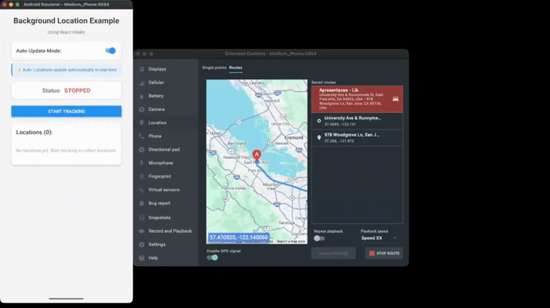

# @gabriel-sisjr/react-native-background-location

[](https://www.npmjs.com/package/@gabriel-sisjr/react-native-background-location)
[](https://www.npmjs.com/package/@gabriel-sisjr/react-native-background-location/v/beta)
[](https://www.npmjs.com/package/@gabriel-sisjr/react-native-background-location)
[](https://www.npmjs.com/package/@gabriel-sisjr/react-native-background-location)
[](https://github.com/gabriel-sisjr/react-native-background-location/actions/workflows/ci.yml)
[](https://codecov.io/gh/gabriel-sisjr/react-native-background-location)
[](https://github.com/gabriel-sisjr/react-native-background-location/actions/workflows/prerelease.yml)
[](https://github.com/gabriel-sisjr/react-native-background-location/actions/workflows/publish.yml)
[](https://github.com/gabriel-sisjr/react-native-background-location/stargazers)
[](https://github.com/gabriel-sisjr/react-native-background-location/blob/develop/LICENSE)
[](https://bundlephobia.com/package/@gabriel-sisjr/react-native-background-location)


A cross-platform React Native library for background location tracking built on TurboModules (New Architecture). Tracks user location reliably on both Android and iOS even when the app is minimized, with persistent storage, crash recovery, and platform-native behavior.

**[Read the full documentation](https://gabriel-sisjr.github.io/react-native-background-location/)**



## Table of Contents

- [Features](#features)
- [Installation](#installation)
- [Quick Start](#quick-start)
- [Hooks](#hooks)
- [API Reference](#api-reference)
- [Types](#types)
- [Enums](#enums)
- [Notification Customization](#notification-customization)
- [Documentation](#documentation)
- [Platform Support](#platform-support)
- [Contributing](#contributing)
- [License](#license)

## Features

- Cross-platform background location tracking (Android and iOS)
- Real-time event-driven location updates on both platforms
- Crash recovery with automatic session restoration (WorkManager on Android, significant location monitoring on iOS)
- Configurable accuracy levels and update intervals for battery efficiency
- Distance filtering and callback throttling
- Session-based tracking organized by trip IDs
- Persistent storage: Room Database (Android) / Core Data (iOS)
- Full notification customization on Android: icons, colors, action buttons, dynamic updates
- Static notification defaults via AndroidManifest or convention drawables (Android)
- Android 14/15 compliance (foreground service type, timeout handling)
- Provider abstraction with Google Play Services primary and fallback provider (Android)
- CLLocationManager with WhenInUse and Always authorization levels (iOS)
- Foreground-only mode (no background permission required)
- Fully typed TypeScript API with unified cross-platform hooks

## Installation

```sh
npm install @gabriel-sisjr/react-native-background-location
# or
yarn add @gabriel-sisjr/react-native-background-location
```

### Android Setup

Add the required permissions to `android/app/src/main/AndroidManifest.xml`:

```xml
<manifest xmlns:android="http://schemas.android.com/apk/res/android">
  <uses-permission android:name="android.permission.ACCESS_FINE_LOCATION" />
  <uses-permission android:name="android.permission.ACCESS_COARSE_LOCATION" />
  <uses-permission android:name="android.permission.ACCESS_BACKGROUND_LOCATION" />
  <uses-permission android:name="android.permission.FOREGROUND_SERVICE" />
  <uses-permission android:name="android.permission.FOREGROUND_SERVICE_LOCATION" />
</manifest>
```

> On Android 11+, background location must be requested **separately** from foreground permissions. See the [Quick Start Guide](https://gabriel-sisjr.github.io/react-native-background-location/docs/getting-started/quick-start) for the full permission flow and the [Installation Guide](https://gabriel-sisjr.github.io/react-native-background-location/docs/getting-started/installation) for detailed setup in existing apps.

### iOS Setup

1. Add the following keys to your `Info.plist`:

```xml
<key>NSLocationWhenInUseUsageDescription</key>
<string>We need your location to track your trips.</string>
<key>NSLocationAlwaysAndWhenInUseUsageDescription</key>
<string>We need your location in the background to continue tracking your trips.</string>
```

2. Enable the **Location updates** Background Mode in your Xcode project under Signing & Capabilities.

3. Run `pod install` in your `ios/` directory.

> **iOS:** Unlike Android, iOS does not use a foreground notification for background tracking. Instead, the system shows a blue status bar indicator when the app is using location in the background. See the [iOS Setup Guide](https://gabriel-sisjr.github.io/react-native-background-location/docs/getting-started/ios-setup) for full details and App Store compliance requirements.

## Quick Start

```typescript
import {
  useLocationPermissions,
  useBackgroundLocation,
  useLocationUpdates,
  LocationAccuracy,
} from '@gabriel-sisjr/react-native-background-location';

function TrackingScreen() {
  const { permissionStatus, requestPermissions } = useLocationPermissions();
  const { startTracking, stopTracking, isTracking } = useBackgroundLocation();
  const { locations, lastLocation } = useLocationUpdates({
    onLocationUpdate: (loc) => console.log('New:', loc.latitude, loc.longitude),
  });

  if (!permissionStatus.hasAllPermissions) {
    return <Button title="Grant Permissions" onPress={requestPermissions} />;
  }

  return (
    <View>
      <Text>Status: {isTracking ? 'Tracking' : 'Stopped'}</Text>
      <Text>Points: {locations.length}</Text>
      {lastLocation && <Text>Last: {lastLocation.latitude}, {lastLocation.longitude}</Text>}
      <Button
        title={isTracking ? 'Stop' : 'Start'}
        onPress={() => isTracking
          ? stopTracking()
          : startTracking(undefined, { accuracy: LocationAccuracy.HIGH_ACCURACY })
        }
      />
    </View>
  );
}
```

For step-by-step setup, see the [Quick Start Guide](https://gabriel-sisjr.github.io/react-native-background-location/docs/getting-started/quick-start). For the direct (non-hook) API, see [Using Direct API](#api-reference).

## Hooks

| Hook                                                                                                                                                    | Purpose                                                                                                                        |
| ------------------------------------------------------------------------------------------------------------------------------------------------------- | ------------------------------------------------------------------------------------------------------------------------------ |
| [`useLocationPermissions`](https://gabriel-sisjr.github.io/react-native-background-location/docs/api-reference/hooks/useLocationPermissions) | Manages cross-platform permission flow (Android: foreground, background, notifications; iOS: WhenInUse, Always, notifications) |
| [`useBackgroundLocation`](https://gabriel-sisjr.github.io/react-native-background-location/docs/api-reference/hooks/useBackgroundLocation)   | Full tracking control: start, stop, locations, trip management                                                                 |
| [`useLocationTracking`](https://gabriel-sisjr.github.io/react-native-background-location/docs/api-reference/hooks/useLocationTracking)       | Lightweight tracking status monitor (read-only)                                                                                |
| [`useLocationUpdates`](https://gabriel-sisjr.github.io/react-native-background-location/docs/api-reference/hooks/useLocationUpdates)         | Real-time event-driven location stream with warnings and action callbacks                                                      |

See the [Hooks API Reference](https://gabriel-sisjr.github.io/react-native-background-location/docs/category/hooks) for complete documentation, options, and examples.

## API Reference

> ⚠️ **Upgrading from v0.13.x?** The legacy `BackgroundLocation` default export was removed in v0.14.0. All tracking methods are now top-level **named exports**. See the [v0.14.0 Migration Guide](https://gabriel-sisjr.github.io/react-native-background-location/docs/migration/v0-14-0) for a 2-minute migration recipe (sed/Node codemod included).

```typescript
// v0.14.0+
import {
  startTracking,
  stopTracking,
  updateNotification,
} from '@gabriel-sisjr/react-native-background-location';

await startTracking('trip-123');
await updateNotification('Delivery #1234', 'Arriving soon');
await stopTracking();
```

### Methods

| Method               | Signature                                                         | Description                                          |
| -------------------- | ----------------------------------------------------------------- | ---------------------------------------------------- |
| `startTracking`      | `(options?: TrackingOptions) => Promise<string>`                  | Start tracking (auto-generates trip ID)              |
| `startTracking`      | `(tripId?: string, options?: TrackingOptions) => Promise<string>` | Start or resume tracking with a specific trip ID     |
| `stopTracking`       | `() => Promise<void>`                                             | Stop tracking and terminate the background service   |
| `isTracking`         | `() => Promise<TrackingStatus>`                                   | Check if tracking is active                          |
| `getLocations`       | `(tripId: string) => Promise<Coords[]>`                           | Retrieve all stored locations for a trip             |
| `clearTrip`          | `(tripId: string) => Promise<void>`                               | Delete all stored data for a trip                    |
| `updateNotification` | `(title: string, text: string) => Promise<void>`                  | Update notification content while tracking is active |

### TrackingOptions

All fields are optional. Defaults are applied when omitted.

| Field                     | Type                  | Default         | Description                                                                                             |
| ------------------------- | --------------------- | --------------- | ------------------------------------------------------------------------------------------------------- |
| `updateInterval`          | `number`              | `5000`          | Interval between location updates (ms)                                                                  |
| `fastestInterval`         | `number`              | `3000`          | Fastest allowed update interval (ms)                                                                    |
| `maxWaitTime`             | `number`              | `10000`         | Max wait before delivering batched updates (ms)                                                         |
| `accuracy`                | `LocationAccuracy`    | `HIGH_ACCURACY` | Location accuracy priority                                                                              |
| `activityType`            | `LocationActivityType`| `OTHER`         | iOS-only. Motion-classification hint for `CLLocationManager.activityType`. See [iOS Activity Type](#ios-activity-type). |
| `waitForAccurateLocation` | `boolean`             | `false`         | Delay updates until accurate location is available                                                      |
| `distanceFilter`          | `number`              | `0`             | Minimum distance (meters) between updates. `0` = no filter                                              |
| `foregroundOnly`          | `boolean`             | `false`         | Track only while app is visible (no background permission needed)                                       |
| `onUpdateInterval`        | `number`              | `undefined`     | Throttle callback execution (ms). Locations still collected at `updateInterval`                         |
| `notificationOptions`     | `NotificationOptions` | see below       | Notification configuration for the foreground service. See [NotificationOptions](#notificationoptions). |

> **Platform applicability:** `updateInterval`, `fastestInterval`, `maxWaitTime`, and `waitForAccurateLocation` are **Android-only** at the native layer. They are accepted on iOS for cross-platform readability but have no effect — iOS uses `accuracy` and `distanceFilter` as its only tuning inputs. `notificationOptions` is also Android-only (iOS shows the system blue status-bar indicator instead of a foreground notification).

#### iOS Activity Type

The `activityType` field hints to iOS's motion-classification subsystem about what kind of trip is being tracked. iOS uses this hint to decide how aggressively to auto-pause location updates to save battery. The library defaults to `LocationActivityType.OTHER`, which is the recommended value for ride-share, delivery, fleet-tracking, courier, and any non-navigation use case.

```typescript
import {
  startTracking,
  LocationActivityType,
} from '@gabriel-sisjr/react-native-background-location';

await startTracking('trip-id', {
  activityType: LocationActivityType.OTHER, // default — explicit for clarity
});
```

| Enum value | iOS `CLActivityType` | Typical use case | Pause / auto-resume behavior |
| --- | --- | --- | --- |
| `OTHER` (default) | `.other` | Generic tracking; works well for delivery, courier, or mixed-modality trips | iOS does **not** auto-pause; the library does not need to auto-resume |
| `AUTOMOTIVE_NAVIGATION` | `.automotiveNavigation` | In-vehicle navigation where the device is mounted | iOS may pause after 2-3 min stationary; the library auto-resumes during active non-foreground-only trips |
| `FITNESS` | `.fitness` | Walking, running, cycling, indoor sports | iOS may pause when motion is undetected; library auto-resumes during active non-foreground-only trips |
| `OTHER_NAVIGATION` | `.otherNavigation` | Non-automotive navigation (boats, trains, etc.) | iOS may pause when stationary; library auto-resumes during active non-foreground-only trips |
| `AIRBORNE` | `.airborne` | Drones, aircraft, aviation telemetry | iOS may pause when stationary; library auto-resumes during active non-foreground-only trips |

> ℹ️ **Auto-resume behavior:** When iOS pauses location updates via `didPauseLocationUpdates` during an active non-`foregroundOnly` trip, the library immediately calls `startUpdatingLocation()` to resume the stream. The `LOCATION_UPDATES_PAUSED` warning event is still emitted via `useLocationUpdates`'s `onLocationWarning` callback for observability, so consumers can log pauses without needing to react to them to keep the stream alive.

> **Android:** `activityType` is iOS-only at the native layer. The option crosses the TurboModule bridge as a string and is silently ignored by the Android Kotlin module. Passing `activityType` from cross-platform code is safe.

##### Migrating from v0.16.0 to v0.17.0

In v0.16.0 and earlier the iOS default activity type was hardcoded to `automotiveNavigation`. v0.17.0 changes that default to `other` to fix issue [#44](https://github.com/gabriel-sisjr/react-native-background-location/issues/44), where iOS would stop emitting location updates 2–3 minutes after the device became stationary because the motion classifier decided the "automotive navigation" hint no longer matched the observed motion.

**For most apps, no change is required.** The new default (`other`) is the correct value for ride-share, delivery, fleet-tracking, and any non-navigation use case. Recompile against v0.17.0 and the bug disappears.

**For turn-by-turn navigation apps**, restore the previous behavior by passing the option explicitly:

```typescript
import {
  startTracking,
  LocationActivityType,
} from '@gabriel-sisjr/react-native-background-location';

await startTracking('trip-id', {
  activityType: LocationActivityType.AUTOMOTIVE_NAVIGATION,
});
```

A new auto-resume guard now reverses any system-initiated pause while the trip is active (any `activityType`, except when `foregroundOnly: true`). The `LOCATION_UPDATES_PAUSED` warning event continues to fire for observability, but consumers no longer need to react to it to keep the stream alive.

> **No types or imports changed.** This is a runtime default change only. See the [CHANGELOG](CHANGELOG.md) for the full release notes.

#### NotificationOptions

All fields are optional. These configure the Android foreground service notification. On iOS, notification fields are silently ignored.

| Field           | Type                   | Default                                  | Description                                          |
| --------------- | ---------------------- | ---------------------------------------- | ---------------------------------------------------- |
| `title`         | `string`               | `"Location Tracking"`                    | Notification title                                   |
| `text`          | `string`               | `"Tracking your location in background"` | Notification body text                               |
| `channelName`   | `string`               | `"Background Location"`                  | Android notification channel name                    |
| `channelId`     | `string`               | `"background_location_channel"`          | Custom notification channel ID                       |
| `priority`      | `NotificationPriority` | `LOW`                                    | Notification priority                                |
| `smallIcon`     | `string`               | system default                           | Drawable resource name for small icon                |
| `largeIcon`     | `string`               | `undefined`                              | Drawable resource name for large icon                |
| `color`         | `string`               | `undefined`                              | Hex color for notification accent (e.g. `"#FF5722"`) |
| `showTimestamp` | `boolean`              | `false`                                  | Show timestamp on notification                       |
| `subtext`       | `string`               | `undefined`                              | Subtext below notification content                   |
| `actions`       | `NotificationAction[]` | `undefined`                              | Up to 3 action buttons on the notification           |

## Types

### Coords

```typescript
interface Coords {
  latitude: string;
  longitude: string;
  timestamp: number;
  accuracy?: number;
  altitude?: number;
  speed?: number;
  bearing?: number;
  verticalAccuracyMeters?: number;
  speedAccuracyMetersPerSecond?: number;
  bearingAccuracyDegrees?: number;
  elapsedRealtimeNanos?: number;
  provider?: string;
  isFromMockProvider?: boolean;
}
```

> **Note:** `latitude` and `longitude` are strings to preserve full decimal precision. Parse with `parseFloat()` when using with map libraries.

### TrackingStatus

```typescript
interface TrackingStatus {
  active: boolean;
  tripId?: string;
}
```

### LocationUpdateEvent

```typescript
interface LocationUpdateEvent {
  tripId: string;
  latitude: string;
  longitude: string;
  timestamp: number;
  accuracy?: number;
  altitude?: number;
  speed?: number;
  bearing?: number;
  verticalAccuracyMeters?: number;
  speedAccuracyMetersPerSecond?: number;
  bearingAccuracyDegrees?: number;
  elapsedRealtimeNanos?: number;
  provider?: string;
  isFromMockProvider?: boolean;
}
```

### LocationWarningEvent and LocationWarningType

```typescript
type LocationWarningType =
  | 'SERVICE_TIMEOUT'
  | 'TASK_REMOVED'
  | 'LOCATION_UNAVAILABLE';

interface LocationWarningEvent {
  tripId: string;
  type: LocationWarningType;
  message: string;
  timestamp: number;
}
```

### NotificationAction and NotificationActionEvent

```typescript
interface NotificationAction {
  id: string;
  label: string;
}

interface NotificationActionEvent {
  tripId: string;
  actionId: string;
}
```

### LocationPermissionState

```typescript
interface LocationPermissionState {
  hasPermission: boolean;
  status: LocationPermissionStatus;
  canRequestAgain: boolean;
}
```

### NotificationPermissionState

```typescript
interface NotificationPermissionState {
  hasPermission: boolean;
  status: NotificationPermissionStatus;
  canRequestAgain: boolean;
}
```

### PermissionState

```typescript
interface PermissionState {
  hasAllPermissions: boolean;
  location: LocationPermissionState;
  notification: NotificationPermissionState;
}
```

`hasAllPermissions` is `true` only when both location and notification permissions are granted. Individual permission states are accessible via the `location` and `notification` sub-objects.

### UseLocationPermissionsResult

```typescript
interface UseLocationPermissionsResult {
  permissionStatus: PermissionState;
  requestPermissions: () => Promise<boolean>;
  checkPermissions: () => Promise<boolean>;
  isRequesting: boolean;
}
```

### UseBackgroundLocationResult

```typescript
interface UseBackgroundLocationResult {
  tripId: string | null;
  isTracking: boolean;
  locations: Coords[];
  isLoading: boolean;
  error: Error | null;
  startTracking: (
    customTripId?: string,
    options?: TrackingOptions
  ) => Promise<string | null>;
  stopTracking: () => Promise<void>;
  refreshLocations: () => Promise<void>;
  clearCurrentTrip: () => Promise<void>;
  clearError: () => void;
}
```

### UseLocationTrackingOptions

```typescript
interface UseLocationTrackingOptions {
  autoStart?: boolean;
  tripId?: string;
  options?: TrackingOptions;
  onTrackingStart?: (tripId: string) => void;
  onTrackingStop?: () => void;
  onError?: (error: Error) => void;
}
```

### UseLocationTrackingResult

```typescript
interface UseLocationTrackingResult {
  isTracking: boolean;
  tripId: string | null;
  refresh: () => Promise<void>;
  isLoading: boolean;
}
```

### UseLocationUpdatesOptions

```typescript
interface UseLocationUpdatesOptions {
  tripId?: string;
  onLocationUpdate?: (location: Coords) => void;
  onUpdateInterval?: number;
  onLocationWarning?: (warning: LocationWarningEvent) => void;
  onNotificationAction?: (event: NotificationActionEvent) => void;
  autoLoad?: boolean;
}
```

### UseLocationUpdatesResult

```typescript
interface UseLocationUpdatesResult {
  tripId: string | null;
  isTracking: boolean;
  locations: Coords[];
  lastLocation: Coords | null;
  lastWarning: LocationWarningEvent | null;
  isLoading: boolean;
  error: Error | null;
  clearError: () => void;
  clearLocations: () => Promise<void>;
}
```

## Enums

### LocationAccuracy

| Value                     | Description                                           |
| ------------------------- | ----------------------------------------------------- |
| `HIGH_ACCURACY`           | GPS + sensors. Best accuracy, highest battery usage.  |
| `BALANCED_POWER_ACCURACY` | Balanced accuracy and power consumption.              |
| `LOW_POWER`               | Network-based. Lower accuracy, better battery.        |
| `NO_POWER`                | Only receives updates requested by other apps.        |
| `PASSIVE`                 | Passive updates from other apps. No additional power. |

### LocationActivityType

iOS-only at the native layer. See [iOS Activity Type](#ios-activity-type) for the full per-value table including the pause/auto-resume behavior on iOS.

| Value                   | iOS `CLActivityType`    | Description                                                              |
| ----------------------- | ----------------------- | ------------------------------------------------------------------------ |
| `OTHER` (default)       | `.other`                | General-purpose tracking. Recommended for delivery, courier, ride-share. |
| `AUTOMOTIVE_NAVIGATION` | `.automotiveNavigation` | Turn-by-turn driving apps.                                               |
| `FITNESS`               | `.fitness`              | Walking, running, cycling.                                               |
| `OTHER_NAVIGATION`      | `.otherNavigation`      | Non-automotive navigation (boats, trains).                               |
| `AIRBORNE`              | `.airborne`             | Drones, aircraft, aviation telemetry.                                    |

### NotificationPriority

| Value     | Description                     |
| --------- | ------------------------------- |
| `LOW`     | Minimal notification (default). |
| `DEFAULT` | Default system priority.        |
| `HIGH`    | More prominent notification.    |
| `MAX`     | Urgent notification.            |

### LocationPermissionStatus

| Value          | Description                                                                      |
| -------------- | -------------------------------------------------------------------------------- |
| `GRANTED`      | All required permissions granted (full background access).                       |
| `WHEN_IN_USE`  | iOS only: WhenInUse permission granted. Tracking works but may have limitations. |
| `DENIED`       | Permission denied (can request again).                                           |
| `BLOCKED`      | Permission permanently denied (must open settings).                              |
| `UNDETERMINED` | Permission not yet requested.                                                    |

### NotificationPermissionStatus

| Value          | Description                            |
| -------------- | -------------------------------------- |
| `GRANTED`      | Notification permission granted.       |
| `DENIED`       | Notification permission denied.        |
| `UNDETERMINED` | Notification permission not yet asked. |

## Notification Customization

The foreground service notification supports full visual customization through the `notificationOptions` field on `TrackingOptions` (see [NotificationOptions](#notificationoptions) table above).

**Static defaults** can be configured without runtime code using AndroidManifest metadata or convention-named drawables:

```xml
<!-- AndroidManifest.xml -->
<meta-data android:name="com.backgroundlocation.default_notification_icon"
           android:resource="@drawable/ic_notification" />
<meta-data android:name="com.backgroundlocation.default_notification_color"
           android:resource="@color/notification_accent" />
```

Alternatively, place a drawable named `bg_location_notification_icon` in `res/drawable/` for automatic detection.

**Resolution priority:** Runtime options > AndroidManifest metadata > Convention drawable > System default.

**Dynamic updates** allow changing notification text while tracking is active:

```typescript
import { updateNotification } from '@gabriel-sisjr/react-native-background-location';

await updateNotification('Delivery #1234', 'Arriving in 5 minutes');
```

**Action buttons** (max 3) can be added via `notificationOptions.actions` and handled through the `onNotificationAction` callback in `useLocationUpdates`.

## Localized Permission Rationales

The `requestPermissions` function returned by `useLocationPermissions` accepts an optional `backgroundRationale` to localize the Android background-location system dialog (API 29+):

```typescript
await requestPermissions({
  backgroundRationale: {
    title: 'Permissão de localização',
    message: 'Precisamos da sua localização em segundo plano para registrar suas viagens.',
  },
});
```

Each field is merged independently — fields that are omitted, `undefined`, `null`, empty, or whitespace-only fall back to the built-in English defaults. The option is silently ignored on iOS, on Android < 29, on the foreground-only flow, and on the notification permission request. For the full permission flow, see the [Permissions Guide](https://gabriel-sisjr.github.io/react-native-background-location/docs/getting-started/permissions).

## Documentation

Browse the **[full documentation site](https://gabriel-sisjr.github.io/react-native-background-location/)** for comprehensive guides, API reference, and production checklists.

### Getting Started

- [Quick Start Guide](https://gabriel-sisjr.github.io/react-native-background-location/docs/getting-started/quick-start) -- Get running in 5 minutes
- [Installation Guide](https://gabriel-sisjr.github.io/react-native-background-location/docs/getting-started/installation) -- Detailed setup for existing apps
- [iOS Setup Guide](https://gabriel-sisjr.github.io/react-native-background-location/docs/getting-started/ios-setup) -- iOS-specific configuration and requirements
- [Permissions Guide](https://gabriel-sisjr.github.io/react-native-background-location/docs/getting-started/permissions) -- Cross-platform permission flow

### Guides

- [Background Tracking](https://gabriel-sisjr.github.io/react-native-background-location/docs/guides/background-tracking) -- Full tracking lifecycle
- [Real-Time Updates](https://gabriel-sisjr.github.io/react-native-background-location/docs/guides/real-time-updates) -- Event-driven location watching
- [Geofencing](https://gabriel-sisjr.github.io/react-native-background-location/docs/guides/geofencing) -- Region monitoring
- [Notification Customization](https://gabriel-sisjr.github.io/react-native-background-location/docs/guides/notification-customization) -- Android foreground notification
- [Crash Recovery](https://gabriel-sisjr.github.io/react-native-background-location/docs/guides/crash-recovery) -- Session persistence and recovery

### Production

- [Production Checklist](https://gabriel-sisjr.github.io/react-native-background-location/docs/production/production-checklist) -- Pre-launch checklist
- [Google Play Compliance](https://gabriel-sisjr.github.io/react-native-background-location/docs/production/google-play-compliance) -- Required steps for Play Store approval
- [App Store Compliance](https://gabriel-sisjr.github.io/react-native-background-location/docs/production/app-store-compliance) -- Required steps for App Store approval (iOS)
- [Platform Comparison](https://gabriel-sisjr.github.io/react-native-background-location/docs/production/platform-comparison) -- Android vs iOS behavior differences

### Help

- [Troubleshooting Guide](https://gabriel-sisjr.github.io/react-native-background-location/docs/troubleshooting) -- Symptom -> cause -> fix for common integration issues

## Platform Support

| Platform | Status    | Notes                                                               |
| -------- | --------- | ------------------------------------------------------------------- |
| Android  | Supported | Kotlin native implementation. Min SDK 24, target SDK 34.            |
| iOS      | Supported | Swift native implementation. CLLocationManager, Core Data, iOS 13+. |

> **iOS:** Background tracking on iOS uses the system blue status bar indicator instead of a notification. The `notificationOptions` field in `TrackingOptions` is Android-only and is silently ignored on iOS. See [Platform Comparison](https://gabriel-sisjr.github.io/react-native-background-location/docs/production/platform-comparison) for detailed differences.

## Contributing

Contributions are welcome. See the [Contributing Guide](CONTRIBUTING.md) for development workflow, coding standards, and how to submit pull requests.

## License

MIT
