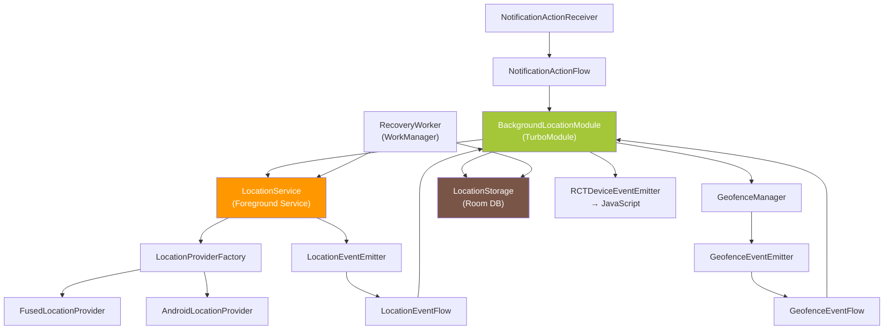
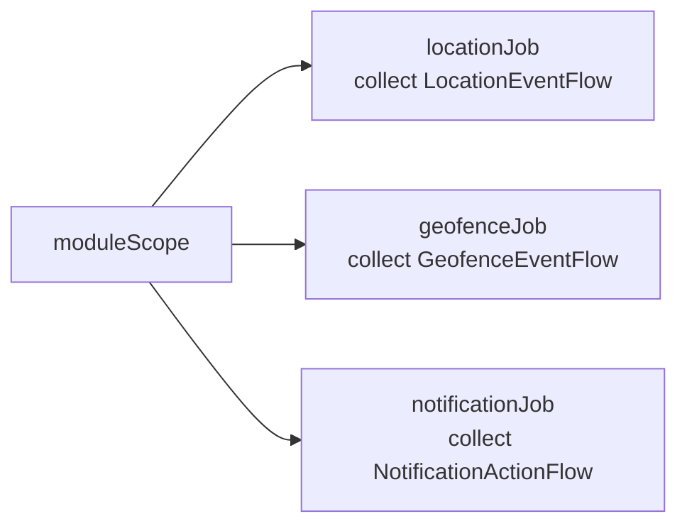
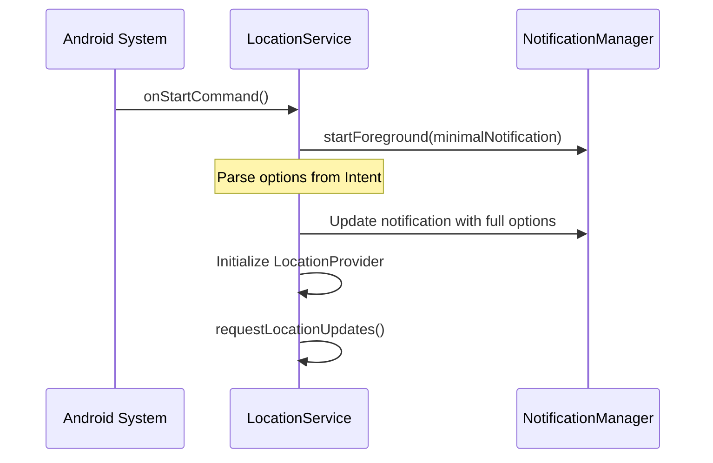
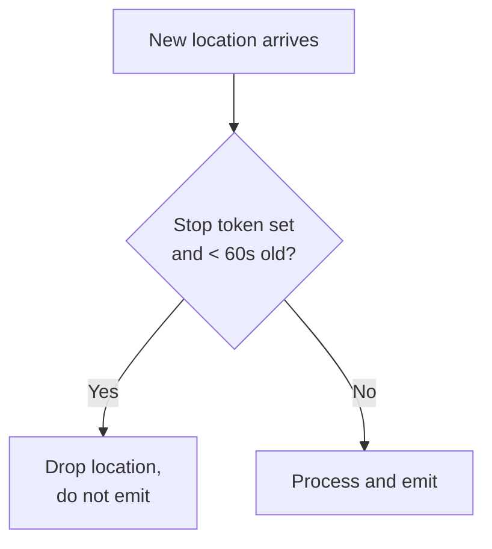
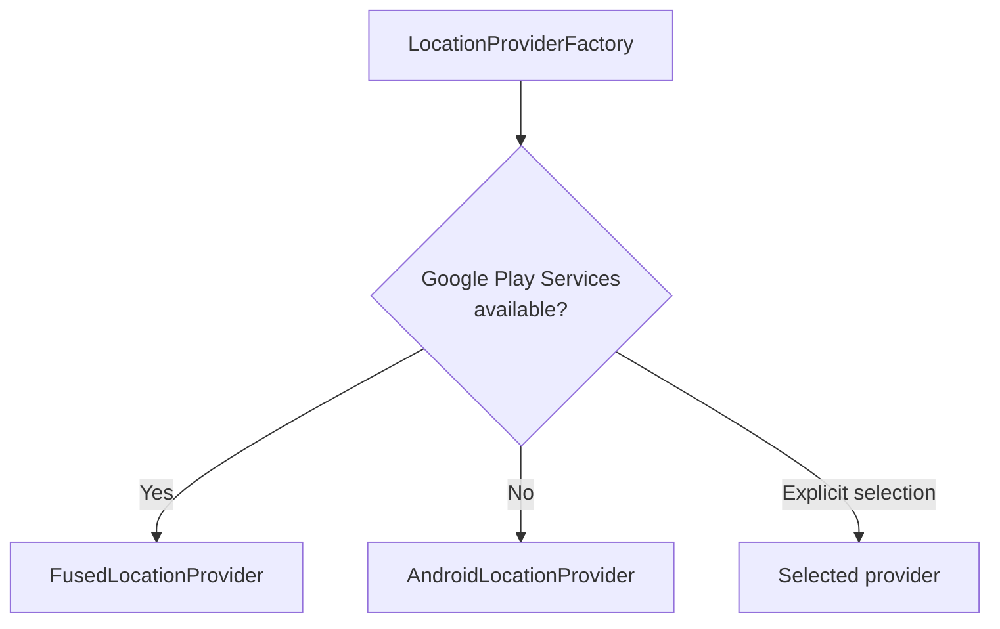
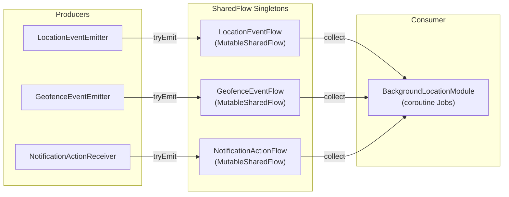
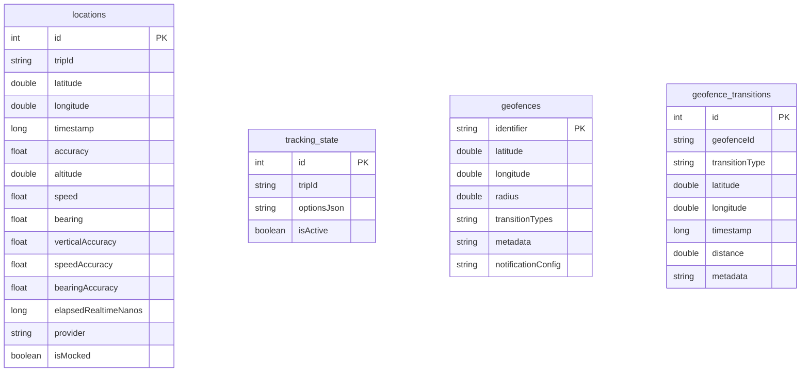
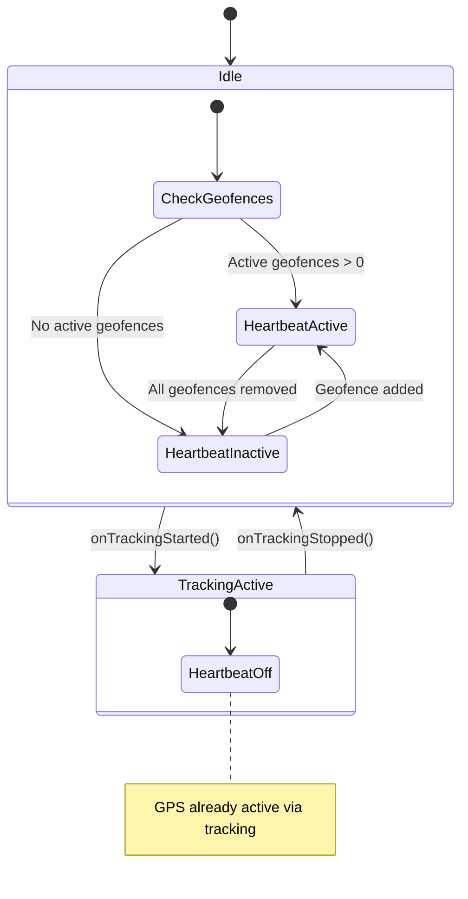
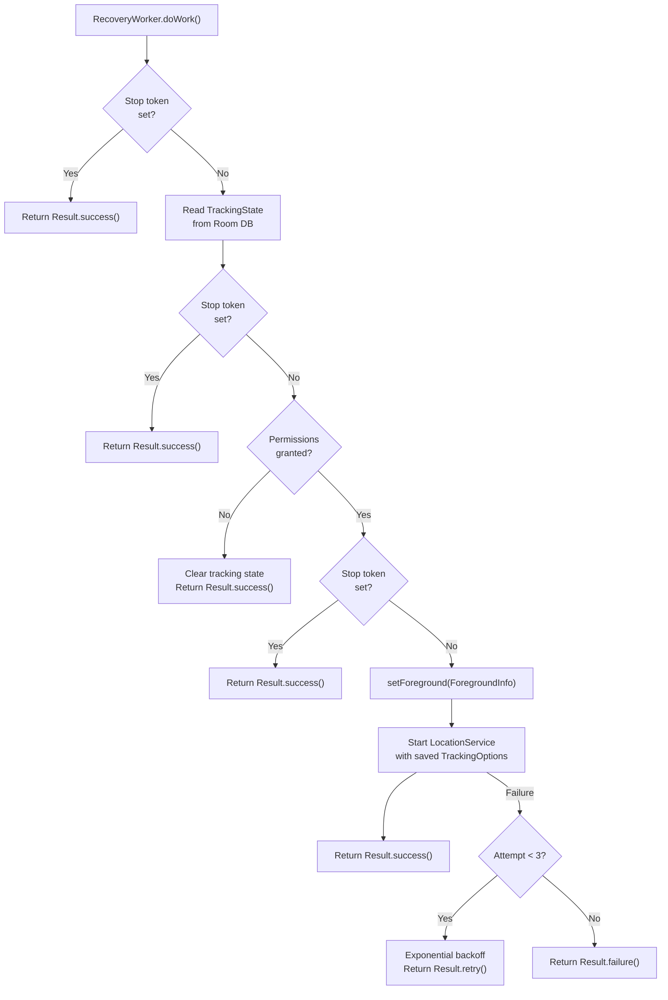

# Android Native Architecture

All Android native code lives under `android/src/main/java/com/backgroundlocation/`. The implementation uses Kotlin with coroutines, Room for persistence, and Google Play Services for location and geofencing.

## Component Overview



## BackgroundLocationModule

The TurboModule entry point. Extends `NativeBackgroundLocationSpec` (Codegen-generated) and implements `LifecycleEventListener`.

### Responsibilities

- **Options parsing** -- Converts `ReadableMap` from JavaScript into the Kotlin `TrackingOptions` data class.
- **Lifecycle management** -- Listens for host resume/pause/destroy events via `LifecycleEventListener`.
- **Event collection** -- Collects events from three SharedFlow singletons using coroutine Jobs scoped to `moduleScope`.
- **Event forwarding** -- Converts collected events to `WritableMap` and emits via `RCTDeviceEventEmitter`.
- **Recovery orchestration** -- On resume, checks stop token and tracking state, then schedules `RecoveryWorker` (API 31+) or recovers directly.

### Coroutine Scoping

```kotlin
private val moduleScope = CoroutineScope(SupervisorJob() + Dispatchers.Main)
```

All event collection runs on `Dispatchers.Main` because `RCTDeviceEventEmitter` must be called from the main thread. `SupervisorJob` ensures that a failure in one collection Job does not cancel the others.

Three collection Jobs run concurrently:



### Stop Sequence

When `stopTracking()` is called:

1. Set stop token in SharedPreferences (synchronous `commit()`).
2. Cancel pending `RecoveryWorker` via WorkManager.
3. Call `removeLocationUpdates()` on the active `LocationService` instance.
4. Save tracking state synchronously via `saveTrackingStateSync()`.
5. Stop the `LocationService`.

## LocationService

A foreground service (`Service`) that manages the GPS pipeline. This is the core component that keeps location tracking alive when the app is in the background.

### Foreground Service Startup

Android 12+ (API 31) requires `startForeground()` within 5-10 seconds of service creation. The service handles this by calling `startForeground()` immediately in `onStartCommand()` with a minimal notification, then updating to the full notification once options are parsed.



> Android 14+ (API 34) requires passing `FOREGROUND_SERVICE_TYPE_LOCATION` to `startForeground()` at runtime.

### Restart Loop Detection

SharedPreferences tracks two values: a restart counter and a timestamp. If more than 5 restarts occur within a 1-hour window, the service refuses to start and clears tracking state:

| Condition | Action |
|-----------|--------|
| Counter < 5 within 1 hour | Allow start, increment counter |
| Counter >= 5 within 1 hour | Refuse start, clear tracking state |
| Counter > 0 but timestamp > 1 hour ago | Reset counter, allow start |
| Clean shutdown (`onDestroy`) | Reset counter |

### Stop Token Mechanism

A boolean flag in SharedPreferences with a 60-second TTL. Checked at every location update in `handleLocation()` to suppress late callbacks that may arrive after `stopTracking()`:



### Service Flags and Callbacks

| Method | Behavior |
|--------|----------|
| `onStartCommand()` | Returns `START_REDELIVER_INTENT` for predictable system restart |
| `onTimeout()` (API 35+) | Emits `SERVICE_TIMEOUT` warning, schedules restart via `Handler`, stops current instance |
| `onTaskRemoved()` | Emits `TASK_REMOVED` warning; service continues (`stopWithTask="false"` in manifest) |
| `onDestroy()` | Cleans up provider, resets restart counter |

### Static Access

`LocationService` exposes a volatile `activeInstance` companion property and a static `isRunning` flag. These allow `BackgroundLocationModule` to directly access the running service for immediate stop and notification updates without service binding.

## Location Providers

### Factory Pattern



Both providers implement the `LocationProvider` interface:

```kotlin
interface LocationProvider {
    fun requestLocationUpdates(options: TrackingOptions, callback: LocationUpdateCallback)
    fun removeLocationUpdates()
    fun getLastLocation(callback: (Location?) -> Unit)
    fun isAvailable(): Boolean
    fun cleanup()
}
```

### FusedLocationProvider

Uses Google Play Services `FusedLocationProviderClient`. Features:

- Distance filter via `setMinUpdateDistanceMeters()`.
- Priority mapping from library accuracy enum to `Priority.PRIORITY_*` constants.
- Availability check via `GoogleApiAvailability.getInstance()`.
- Calls `removeLocationUpdates()` at the start of `requestLocationUpdates()` to prevent duplicate callback accumulation.

### AndroidLocationProvider

Fallback for devices without Google Play Services (e.g., Huawei, Amazon). Uses Android's native `LocationManager`:

| Library Accuracy | Android Provider |
|-----------------|-----------------|
| `HIGH_ACCURACY` | `GPS_PROVIDER` |
| `BALANCED_POWER_ACCURACY` | `NETWORK_PROVIDER` |
| `LOW_POWER` | `NETWORK_PROVIDER` |
| `NO_POWER` / `PASSIVE` | `PASSIVE_PROVIDER` |

Also calls `removeLocationUpdates()` before `requestLocationUpdates()` to prevent duplicates.

## SharedFlow Event System

The library uses three SharedFlow singletons to decouple event producers (services, receivers) from the consumer (`BackgroundLocationModule`).

### Architecture



### SharedFlow Configuration

All three flows share identical settings:

| Parameter | Value | Rationale |
|-----------|-------|-----------|
| `replay` | 0 | No event replay for late subscribers |
| `extraBufferCapacity` | 64 | Absorb bursts without blocking producers |
| `onBufferOverflow` | `DROP_OLDEST` | Prefer fresh data over completeness |

### Sealed Interfaces

Each flow uses a sealed interface for type-safe event discrimination:

- **`LocationEvent`** -- `Update(tripId, data)`, `Error(tripId, type, message)`, `Warning(tripId, type, message)`
- **`GeofenceEvent`** -- `Transition(geofenceId, type, coordinates, timestamp, distance, metadata)`
- **`NotificationActionEvent`** -- `ActionClicked(tripId, actionId)`

### Why SharedFlow Over BroadcastReceiver

The original implementation used `LocalBroadcastManager` and `BroadcastReceiver` for event routing. SharedFlow provides:

- **Type safety** -- Sealed interfaces prevent invalid event types at compile time.
- **No serialization overhead** -- Events carry Kotlin objects directly instead of Bundle/Intent extras.
- **Structured concurrency** -- Collection is scoped to `moduleScope` and cancels cleanly.
- **Backpressure handling** -- `DROP_OLDEST` strategy prevents slow consumers from blocking producers.

## Room Database

### Schema

Room schema version 1 with `fallbackToDestructiveMigration()`. No migration chain since this is a pre-1.0 library.



### LocationStorage

Thread-safe persistence layer built on Room. Key design:

- **Batched writes** -- `ConcurrentLinkedQueue` buffer, flushed at 10 items or every 5 seconds.
- **Force flush** -- `forceFlush()` drains buffer before reads to guarantee consistency.
- **Tracking state** -- Single-row table (`id = 1`) with full `TrackingOptions` JSON serialization.
- **Synchronous save** -- `saveTrackingStateSync()` suspend function for the stop sequence to prevent race conditions.
- **Coroutine scope** -- `SupervisorJob() + Dispatchers.IO` for all database operations.
- **Cleanup** -- `cleanup()` cancels the batch timer, flushes pending writes, and cancels the scope.

## GeofenceManager

Manages the full geofence lifecycle: registration, removal, persistence, recovery, and location heartbeat.

### Tracking Coordination



When tracking is active, the GPS pipeline is already warm, so the heartbeat is unnecessary. When tracking stops but geofences remain registered, `GeofenceManager` starts a low-frequency location heartbeat to keep passive geofence detection working.

### Hooks

| Hook | When Called | Action |
|------|-----------|--------|
| `onTrackingStarted()` | `LocationService` begins tracking | Stop heartbeat (GPS already active) |
| `onTrackingStopped()` | `LocationService` stops tracking | Start heartbeat if geofences exist |

## RecoveryWorker

A `CoroutineWorker` scheduled via WorkManager for crash recovery on Android 12+ (API 31+). Older APIs recover directly in `BackgroundLocationModule.onHostResume()`.

### Recovery Pipeline



The stop token is checked at three separate points (before state read, after state read, before service start) to handle race conditions where `stopTracking()` is called while recovery is in progress.

> `RecoveryWorker` uses `setForeground(ForegroundInfo(...))` to comply with Android 12+ background start restrictions. This creates a short-lived system foreground service specifically for the recovery operation.

### Retry Strategy

| Attempt | Backoff |
|---------|---------|
| 1 | Exponential (default ~30s) |
| 2 | Exponential (~60s) |
| 3 | Final attempt |
| > 3 | `Result.failure()`, no more retries |

## Notification System

### NotificationDefaults

Resolves notification icons and colors using a four-level priority chain:

1. **Runtime** -- Values passed in `TrackingOptions` at start time.
2. **Manifest metadata** -- `<meta-data>` keys in AndroidManifest.xml (`com.backgroundlocation.default_notification_icon`, etc.).
3. **Conventional drawables** -- Resource names `bg_location_notification_icon` and `bg_location_notification_large_icon`.
4. **System default** -- `android.R.drawable.ic_menu_mylocation`.

Values are cached after first resolution.

### NotificationActionReceiver

A manifest-registered `BroadcastReceiver` for notification button taps. When the user presses a notification action button:

1. Android delivers a `PendingIntent` broadcast to `NotificationActionReceiver`.
2. The receiver extracts the action ID and trip ID from the intent.
3. It emits an `ActionClicked` event directly to `NotificationActionFlow`.
4. `BackgroundLocationModule` collects the event and forwards it to JavaScript as `onNotificationAction`.

### Dynamic Updates

`updateNotification(title, text)` accesses `LocationService.activeInstance` directly to update the notification content at runtime. Changes are transient -- they are not persisted to the database and will revert to the original values on service restart.

## Permission Checks

`BackgroundLocationModule` checks permissions based on the tracking mode:

| Mode | Permissions Checked |
|------|-------------------|
| Background tracking | `ACCESS_FINE_LOCATION` + `ACCESS_BACKGROUND_LOCATION` (API 29+) + `POST_NOTIFICATIONS` (API 33+) |
| Foreground-only | `ACCESS_FINE_LOCATION` + `POST_NOTIFICATIONS` (API 33+) |

When `foregroundOnly: true`, `ACCESS_BACKGROUND_LOCATION` is skipped entirely.

## Next Steps

- [iOS Native Architecture](./ios-native.md) -- The iOS counterpart using CLLocationManager and Core Data.
- [Data Flow](./data-flow.md) -- Cross-platform data flow comparison.
