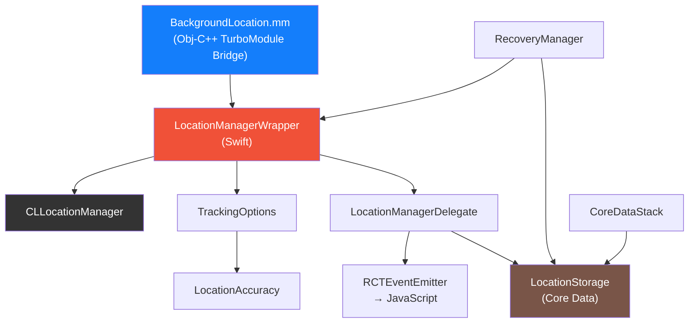
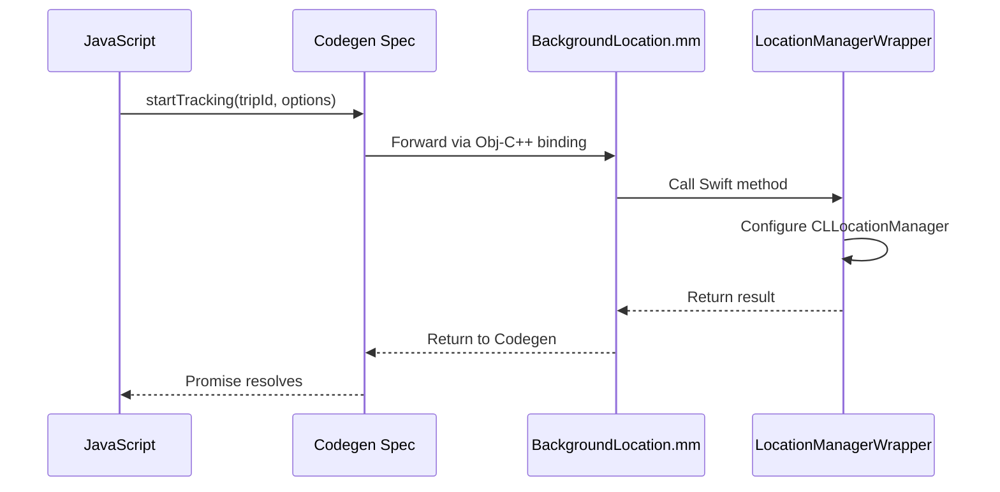
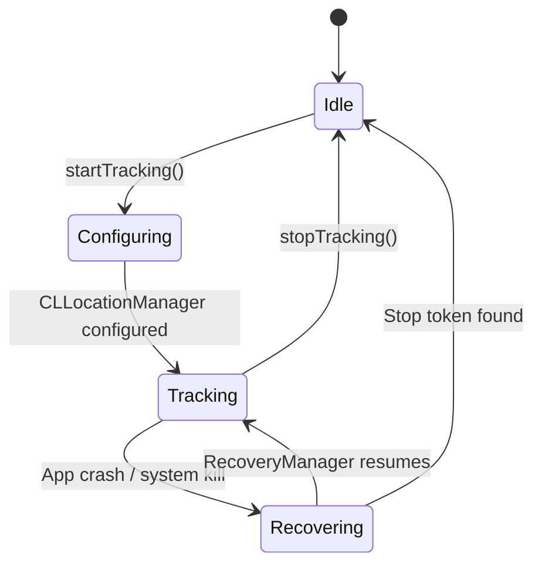
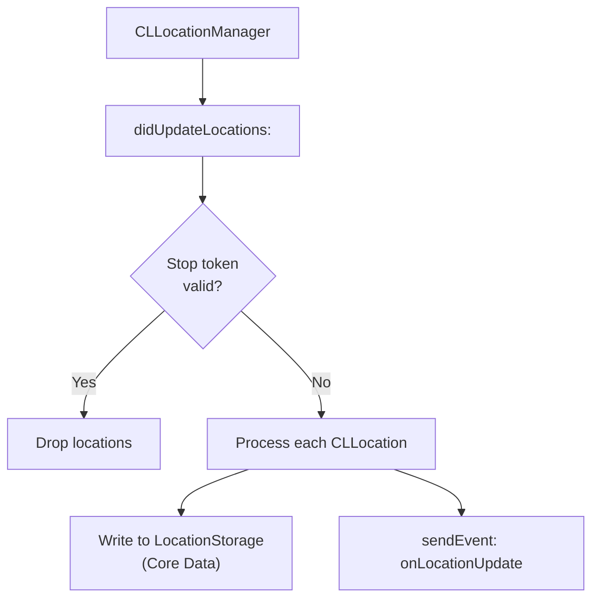
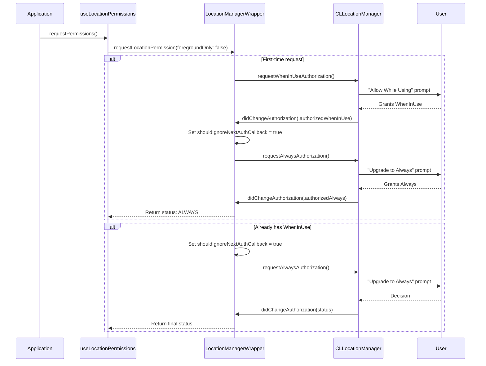
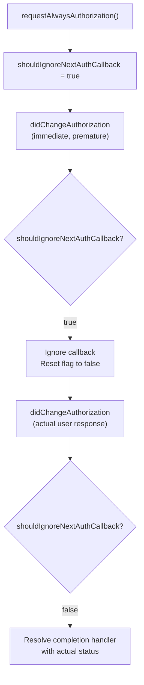
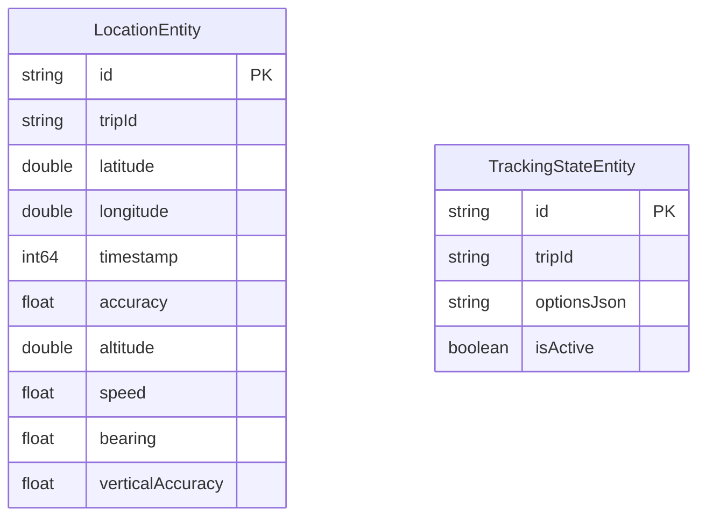
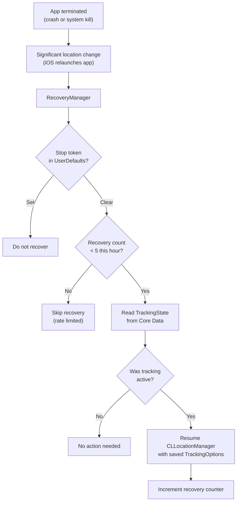
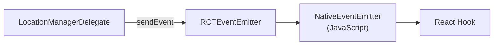

# iOS Native Architecture

All iOS native code lives under `ios/`. The implementation uses Swift for business logic with an Objective-C++ bridge file for TurboModule compatibility. Persistence uses Core Data with a SQLite store.

## Component Overview

## TurboModule Bridge

### BackgroundLocation.mm

The Objective-C++ bridge file connects the Codegen-generated spec to the Swift implementation. It uses `@objc` protocol conformance to forward all spec methods.

The bridge handles type conversion between React Native types (`ReadableMap`, `WritableMap`) and Swift types. All TurboModule spec methods are declared in this file and forwarded to Swift classes.

> This Objective-C++ bridge is necessary because React Native's TurboModule Codegen generates Objective-C++ code, and Swift classes cannot directly conform to the generated spec protocol.

## LocationManagerWrapper

The central orchestrator for all `CLLocationManager` operations. This is the iOS equivalent of Android's `LocationService` + `LocationProvider` combined.

### Configuration

When `startTracking()` is called, `LocationManagerWrapper` configures `CLLocationManager` with:

| Property | Source | Default |
|----------|--------|---------|
| `desiredAccuracy` | `TrackingOptions.accuracy` mapped via `LocationAccuracy` | `kCLLocationAccuracyBest` |
| `distanceFilter` | `TrackingOptions.distanceFilter` | `kCLDistanceFilterNone` |
| `allowsBackgroundLocationUpdates` | Always `true` | -- |
| `pausesLocationUpdatesAutomatically` | `TrackingOptions` | `false` |
| `activityType` | Mapped from options | `.other` |
| `showsBackgroundLocationIndicator` | Always `true` | -- |

### Lifecycle

### Stop Token

Uses `UserDefaults` to store a boolean flag with a 60-second TTL, mirroring the Android SharedPreferences pattern. Checked before processing each location update in the delegate.

## LocationManagerDelegate

Implements `CLLocationManagerDelegate` to handle all callbacks from `CLLocationManager`.

### Location Updates

Each `CLLocation` is converted to the library's coordinate format with all available fields: latitude, longitude, timestamp, horizontal accuracy, altitude, speed, course (bearing), vertical accuracy, and floor level (when available).

### Error Handling

| Delegate Method | Event Emitted | Description |
|----------------|--------------|-------------|
| `didFailWithError:` | `onLocationError` | Location provider failure |
| `didChangeAuthorization:` (downgrade) | `onLocationWarning` | Permission downgraded while tracking (`PERMISSION_DOWNGRADED`) |
| `didChangeAuthorization:` (revoked) | `onLocationError` | Permission fully revoked while tracking (`PERMISSION_REVOKED`) |

### Authorization Monitoring

The delegate monitors `didChangeAuthorization:` while tracking is active. If the user revokes or downgrades location permission via Settings while the app is tracking, the delegate emits the appropriate error or warning event to JavaScript.

## Always Permission Escalation

iOS requires a two-step permission flow for "Always" location access. The library handles this transparently through `LocationManagerWrapper`.

### The Two-Step Flow

### The shouldIgnoreNextAuthCallback Guard

When `requestAlwaysAuthorization()` is called, iOS may immediately fire `didChangeAuthorization:` with the current (WhenInUse) status before the user has responded to the Always prompt. Without the guard, the completion handler would resolve prematurely with `WHEN_IN_USE` instead of waiting for the actual user decision.

The `shouldIgnoreNextAuthCallback` flag:

1. Is set to `true` immediately before calling `requestAlwaysAuthorization()`.
2. Causes the next `didChangeAuthorization:` callback to be ignored (resets the flag but does not resolve the completion handler).
3. The subsequent callback -- triggered by the actual user response -- resolves normally.

> This guard is necessary because iOS's delegate behavior when assigning a new delegate or calling `requestAlwaysAuthorization()` is to immediately fire `didChangeAuthorization:` with the current authorization status, which would resolve the pending promise before the user has made their choice.

## Core Data Persistence

### CoreDataStack

Sets up the Core Data environment:

- `NSPersistentContainer` with the library's `.xcdatamodeld` model.
- **Main context** for read operations on the main thread.
- **Background context** via `performBackgroundTask` for write operations.
- SQLite store for durable persistence.

### LocationStorage

Core Data persistence layer with batched async writes, mirroring the Android Room implementation.

| Feature | Implementation |
|---------|---------------|
| Batch writes | Array buffer, flushed at 10 items or 5-second timer |
| Force flush | `forceFlush()` drains buffer before reads |
| Tracking state | Core Data entity for crash recovery |
| Thread safety | `performBackgroundTask` for all writes |
| Read operations | Main context queries |

### Data Model

The Core Data model mirrors the Android Room schema:

## RecoveryManager

Handles crash recovery using iOS significant location monitoring -- a system-managed, low-power mechanism that relaunches the app when the device moves a significant distance (typically 500m+).

### Recovery Flow

### Rate Limiting

The recovery manager limits itself to **5 recoveries per hour** to prevent runaway recovery loops. The counter resets after 1 hour from the first recovery.

| Condition | Action |
|-----------|--------|
| Counter < 5, within 1 hour | Allow recovery, increment counter |
| Counter >= 5, within 1 hour | Skip recovery |
| Counter > 0, timestamp > 1 hour old | Reset counter, allow recovery |

### Significant Location Monitoring

When tracking starts, `LocationManagerWrapper` also calls `startMonitoringSignificantLocationChanges()`. This serves as the recovery trigger:

- **While app is running** -- Significant location changes are ignored (normal tracking is active).
- **After app termination** -- iOS relaunches the app in the background when a significant location change occurs, allowing `RecoveryManager` to restore the tracking session.

> Significant location monitoring is very low power. It uses cell tower transitions rather than GPS, so it does not significantly impact battery life.

## TrackingOptions Mapping

`TrackingOptions.swift` converts the bridge values into iOS-native equivalents:

| Bridge Field | iOS Property | Notes |
|-------------|-------------|-------|
| `accuracy` (string) | `CLLocationAccuracy` | Mapped via `LocationAccuracy.swift` |
| `distanceFilter` (number) | `CLLocationDistance` | `0` maps to `kCLDistanceFilterNone` |
| `updateInterval` | Not used | iOS does not support interval-based updates |
| `fastestInterval` | Not used | iOS does not support interval-based updates |
| `foregroundOnly` | `allowsBackgroundLocationUpdates` | Inverted: `foregroundOnly: true` sets background updates to `false` |
| `notificationOptions` | Not used | iOS does not show persistent notifications for location |

> iOS does not support time-based update intervals (`updateInterval`, `fastestInterval`). Location updates are delivered as fast as the hardware provides them, filtered only by `distanceFilter` and `desiredAccuracy`. Android-specific notification fields are silently ignored.

## LocationAccuracy Mapping

`LocationAccuracy.swift` maps the library's accuracy enum to `CLLocationAccuracy` constants:

| Library Value | iOS Constant | Approximate Accuracy |
|--------------|-------------|---------------------|
| `HIGH_ACCURACY` | `kCLLocationAccuracyBest` | ~5m |
| `BALANCED_POWER_ACCURACY` | `kCLLocationAccuracyHundredMeters` | ~100m |
| `LOW_POWER` | `kCLLocationAccuracyKilometer` | ~1km |
| `NO_POWER` / `PASSIVE` | `kCLLocationAccuracyThreeKilometers` | ~3km |

## Event Emission

Unlike Android's SharedFlow architecture, iOS emits events directly from the delegate to JavaScript via `RCTEventEmitter`.

The same four event names are emitted on both platforms:

| Event | Trigger |
|-------|---------|
| `onLocationUpdate` | `didUpdateLocations:` callback |
| `onLocationError` | `didFailWithError:` or permission revoked |
| `onLocationWarning` | Permission downgraded |
| `onNotificationAction` | Not applicable (iOS does not use persistent tracking notifications) |

### addListener / removeListeners

The TurboModule spec requires `addListener(eventName:)` and `removeListeners(count:)` methods on iOS. These are called by `NativeEventEmitter` when JavaScript adds or removes event subscriptions. The implementation tracks listener count to avoid emitting events when no JavaScript listeners are active.

## Platform Differences from Android

| Aspect | Android | iOS |
|--------|---------|-----|
| Background execution | Foreground Service (persistent notification) | CLLocationManager background mode (blue status bar indicator) |
| Update intervals | Configurable (`updateInterval`, `fastestInterval`) | Not supported (hardware-driven) |
| Notification | Required (foreground service) | Not applicable |
| Notification actions | Up to 3 action buttons | Not applicable |
| Location provider | Dual (Fused + Android fallback) | CLLocationManager only |
| Event architecture | SharedFlow singletons + coroutine collection | Direct delegate-to-RCTEventEmitter |
| Recovery mechanism | WorkManager (CoroutineWorker) | Significant location monitoring |
| Recovery rate limit | 5 restarts/hour (restart loop detection) | 5 recoveries/hour (rate limiting) |
| Persistence | Room (SQLite) | Core Data (SQLite) |
| Geofence limit | 100 (Google Play Services) | 20 (CLLocationManager) |
| Permission flow | Sequential prompts via PermissionsAndroid | Two-step WhenInUse-to-Always escalation |

## Next Steps

- [Android Native Architecture](./android-native.md) -- The Android counterpart using Kotlin, Coroutines, and Room.
- [Data Flow](./data-flow.md) -- Cross-platform data flow comparison.
- [Architecture Overview](./overview.md) -- High-level three-layer design and key decisions.
