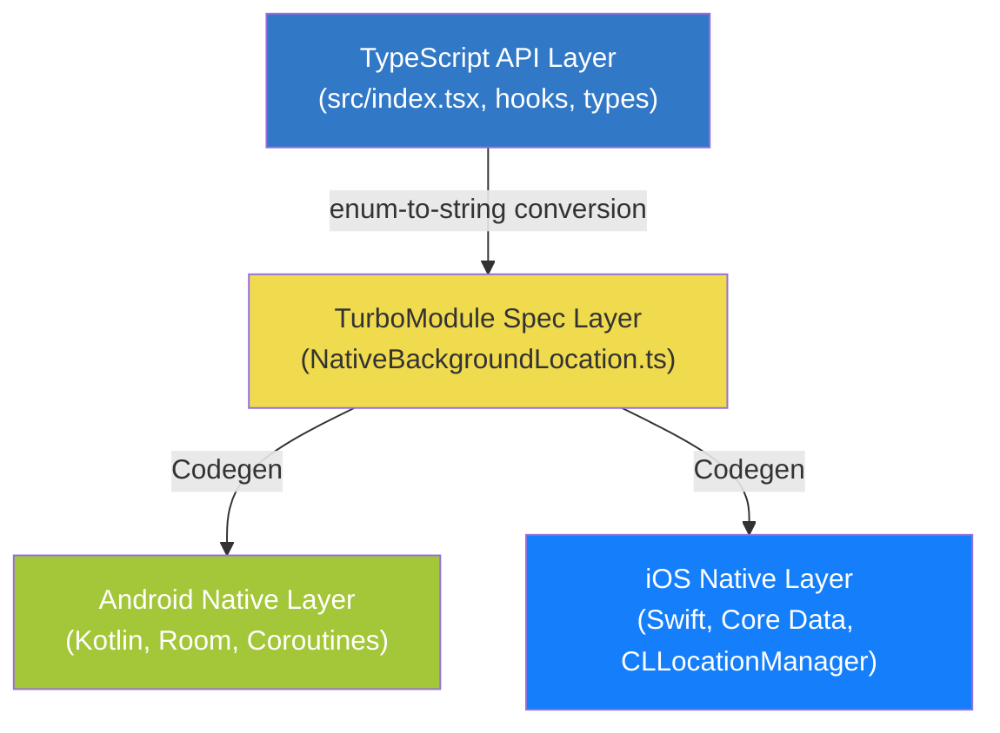

# Architecture Overview

This document describes the high-level architecture of `@gabriel-sisjr/react-native-background-location`. The library follows a three-layer design that separates the public TypeScript API from platform-specific native implementations through a TurboModule bridge contract.

## Three-Layer Design

### Layer 1: TypeScript API

The public-facing layer that application code consumes directly. It provides:

- **Functions** -- `startTracking`, `stopTracking`, `isTracking`, `getLocations`, `clearTrip`, `updateNotification`, and the full geofencing API.
- **React hooks** -- `useLocationPermissions`, `useBackgroundLocation`, `useLocationTracking`, `useLocationUpdates`, `useGeofencing`, `useGeofenceEvents`.
- **Types and enums** -- `LocationAccuracy`, `NotificationPriority`, `TrackingOptions`, `Coords`, `GeofenceRegion`, and others.
- **Error classes** -- `GeofenceError` with typed `GeofenceErrorCode` discriminator.

This layer handles enum-to-string conversion, JSON serialization of complex objects, input validation, and graceful degradation when the native module is unavailable (e.g., simulators).

> The library publishes **named exports only**. There is no default export. Import individual functions directly: `import { startTracking, stopTracking } from '@gabriel-sisjr/react-native-background-location'`.

### Layer 2: TurboModule Spec

`NativeBackgroundLocation.ts` defines the `Spec extends TurboModule` interface consumed by React Native Codegen. This is the contract between TypeScript and native code. Key constraints imposed by Codegen shape this layer:

- **No TypeScript enums** -- Enum values are passed as plain strings. The TypeScript layer converts enums before crossing the bridge.
- **No complex object arrays** -- Geofence regions and notification actions are JSON-serialized into strings.
- **Inline interface definitions** -- `TrackingOptionsSpec` and `PermissionStatusResult` are defined directly in the spec file for Codegen compatibility.

### Layer 3: Native Implementations

Each platform implements the TurboModule spec using platform-idiomatic patterns:

| Concern | Android | iOS |
|---------|---------|-----|
| Language | Kotlin | Swift + Objective-C++ bridge |
| Background execution | Foreground Service (`LocationService`) | CLLocationManager background mode |
| Persistence | Room Database (SQLite) | Core Data (SQLite) |
| Event streaming | SharedFlow singletons + coroutine collection | RCTEventEmitter |
| Crash recovery | WorkManager (`RecoveryWorker`) | Significant location monitoring (`RecoveryManager`) |
| Location provider | Dual: FusedLocationProvider / AndroidLocationProvider | CLLocationManager |
| Geofencing | GeofencingClient (Google Play Services) | CLLocationManager region monitoring |

## Key Design Decisions

### TurboModule Over Bridge Modules

The library uses React Native's New Architecture (TurboModules) exclusively. TurboModules provide synchronous native module access, type-safe Codegen contracts, and lazy initialization -- all critical for a library that manages long-running background services.

### Enum-to-String Conversion at the Bridge

Codegen does not support TypeScript enums. Rather than exposing raw strings in the public API, the library maintains proper TypeScript enums (`LocationAccuracy`, `NotificationPriority`) and converts them to strings in `src/index.tsx` before they cross the bridge via `toTrackingOptionsSpec()`. This keeps the public API type-safe while satisfying Codegen constraints.

### JSON Serialization for Complex Objects

Codegen does not support typed object arrays. Geofence regions, notification actions, and notification options are serialized to JSON strings in TypeScript and deserialized on the native side. This pattern keeps the spec interface simple while supporting arbitrarily complex data structures.

### Named Exports Only

The library exports individual named functions and hooks rather than a monolithic class or default export. This enables tree-shaking, improves discoverability in IDE autocompletion, and avoids the fragile singleton pattern.

### Graceful Degradation

Every public function checks for native module availability before calling into native code. When the module is unavailable (simulators, misconfigured builds), functions log a warning and return sensible fallback values instead of crashing. Geofencing functions throw explicitly since silent degradation would be misleading for geofence registration.

### Stop Token Mechanism

A SharedPreferences/UserDefaults flag with a 60-second TTL prevents the recovery system from restarting tracking after an explicit `stopTracking()` call. The token is checked at multiple points in the recovery pipeline to eliminate race conditions between stop and recovery.

### Restart Loop Detection (Android)

A counter in SharedPreferences tracks service restarts within a 1-hour window. If the count exceeds 5, the service refuses to start and clears tracking state. This prevents infinite crash-restart loops from draining battery or producing system ANRs.

### Batched Database Writes

Both platforms buffer location writes and flush in batches (up to 10 items, or every 5 seconds). This reduces I/O overhead during high-frequency GPS updates. A `forceFlush()` call guarantees consistency before any read operation.

## Technology Stack

| Component | Technology | Rationale |
|-----------|-----------|-----------|
| JS/TS layer | TypeScript, React | Type safety, hook-based API |
| Bridge | TurboModule + Codegen | Type-safe contract, lazy init, New Architecture |
| Android module | Kotlin | Coroutines, null safety, Android-first language |
| Android persistence | Room (SQLite) | Type-safe queries, reactive flows, schema versioning |
| Android concurrency | Coroutines (SupervisorJob + Dispatchers.Main) | Structured concurrency, cancellation support |
| Android background | Foreground Service + WorkManager | Reliable background execution, OS compliance |
| Android location | Google Play Services (FusedLocationProvider) | Battery-efficient, fused sensor data |
| Android fallback | Android LocationManager | Devices without Google Play Services |
| iOS module | Swift + Objective-C++ bridge | Modern Swift with TurboModule bridge compatibility |
| iOS persistence | Core Data (SQLite) | Apple-native, thread-safe, schema migration |
| iOS location | CLLocationManager | Only official iOS location API |
| iOS recovery | Significant location monitoring | System-managed, low-power app relaunch |
| Build system | react-native-builder-bob | CommonJS + ESM + TypeScript declarations |
| Monorepo | Yarn 3.6.1 + Turborepo | Workspace management, parallel builds |

## Cross-Cutting Concerns

### Event System

Both platforms emit the same four event types to JavaScript:

| Event | Description |
|-------|-------------|
| `onLocationUpdate` | New location coordinate received |
| `onLocationError` | Fatal error (permission revoked, provider error) |
| `onLocationWarning` | Non-fatal warning (service timeout, task removed, GPS lost) |
| `onNotificationAction` | Notification action button pressed |

The event names and payload shapes are identical on both platforms, providing a unified API surface for hooks like `useLocationUpdates` and `useGeofenceEvents`.

### Permission Model

The library provides a cross-platform permission flow through `useLocationPermissions`:

- **Android**: Requests `ACCESS_FINE_LOCATION`, then `ACCESS_BACKGROUND_LOCATION` (API 29+), then `POST_NOTIFICATIONS` (API 33+).
- **iOS**: Requests "When In Use" first, then escalates to "Always" via a two-step flow with a `shouldIgnoreNextAuthCallback` guard to handle iOS delegate timing.

### Persistence and Recovery

Both platforms persist tracking state (active status, trip ID, options) to the database. On crash or system kill, the recovery mechanism reads this state and resumes tracking automatically. The stop token prevents recovery after an intentional stop.

## Next Steps

- [Data Flow](./data-flow.md) -- Detailed data flow from hook to native and back.
- [Android Native Architecture](./android-native.md) -- Deep dive into the Android implementation.
- [iOS Native Architecture](./ios-native.md) -- Deep dive into the iOS implementation.
