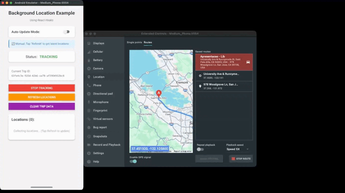

# React Hooks API

`@gabriel-sisjr/react-native-background-location` provides React Hooks for easier integration and better developer experience.

## Overview

The library includes four main hooks:

1. **`useLocationPermissions`** - Manage location permissions
2. **`useBackgroundLocation`** - Full tracking management with manual refresh
3. **`useLocationTracking`** - Lightweight status monitoring
4. **`useLocationUpdates`** - Real-time location watching

## useLocationPermissions

Manages location permissions including foreground and background permissions.

### Basic Usage

```typescript
import { useLocationPermissions } from '@gabriel-sisjr/react-native-background-location';

function PermissionScreen() {
  const {
    permissionStatus,
    requestPermissions,
    checkPermissions,
    isRequesting
  } = useLocationPermissions();

  if (!permissionStatus.hasPermission) {
    return (
      <View>
        <Text>Location permissions required</Text>
        <Button
          title="Grant Permissions"
          onPress={requestPermissions}
          disabled={isRequesting}
        />
      </View>
    );
  }

  return <TrackingScreen />;
}
```

### Return Values

```typescript
interface UseLocationPermissionsResult {
  // Current permission state
  permissionStatus: {
    hasPermission: boolean;
    status: 'granted' | 'denied' | 'blocked' | 'undetermined';
    canRequestAgain: boolean;
  };

  // Request all required permissions
  requestPermissions: () => Promise<boolean>;

  // Check current permissions without requesting
  checkPermissions: () => Promise<boolean>;

  // Whether a request is in progress
  isRequesting: boolean;
}
```

### Permission Status

- **`granted`** - All permissions granted
- **`denied`** - User denied permissions, can request again
- **`blocked`** - User permanently denied (never ask again)
- **`undetermined`** - Permissions not yet requested

### Example: Handling Permission States

```typescript
function PermissionHandler() {
  const { permissionStatus, requestPermissions } = useLocationPermissions();

  if (permissionStatus.status === 'blocked') {
    return (
      <View>
        <Text>Permissions permanently denied</Text>
        <Button
          title="Open Settings"
          onPress={() => Linking.openSettings()}
        />
      </View>
    );
  }

  if (permissionStatus.status === 'denied') {
    return (
      <View>
        <Text>We need location permissions to track your trips</Text>
        <Button title="Grant Permissions" onPress={requestPermissions} />
      </View>
    );
  }

  return <TrackingScreen />;
}
```

## useBackgroundLocation

Complete hook for managing background location tracking, including starting/stopping tracking and managing location data.



*Example app using `useBackgroundLocation` to start/stop a trip and refresh locations.*

### Basic Usage

```typescript
import { useBackgroundLocation } from '@gabriel-sisjr/react-native-background-location';

function TrackingScreen() {
  const {
    isTracking,
    tripId,
    locations,
    isLoading,
    error,
    startTracking,
    stopTracking,
    refreshLocations,
    clearCurrentTrip,
    clearError,
  } = useBackgroundLocation({
    onTrackingStart: (id) => console.log('Started tracking:', id),
    onTrackingStop: () => console.log('Stopped tracking'),
    onError: (err) => console.error('Error:', err),
  });

  return (
    <View>
      <Text>Status: {isTracking ? 'Tracking' : 'Stopped'}</Text>
      {tripId && <Text>Trip ID: {tripId}</Text>}
      <Text>Locations: {locations.length}</Text>

      <Button
        title={isTracking ? 'Stop Tracking' : 'Start Tracking'}
        onPress={isTracking ? stopTracking : () => startTracking()}
        disabled={isLoading}
      />

      {isTracking && (
        <Button
          title="Refresh Locations"
          onPress={refreshLocations}
        />
      )}

      {error && (
        <View>
          <Text>Error: {error.message}</Text>
          <Button title="Dismiss" onPress={clearError} />
        </View>
      )}
    </View>
  );
}
```

### Options

```typescript
interface UseBackgroundLocationOptions {
  // Auto-start tracking when component mounts
  autoStart?: boolean;

  // Existing trip ID to resume tracking (not for creating new trips)
  // ⚠️ Only provide this when resuming an interrupted session
  tripId?: string;

  // Tracking configuration options (intervals, accuracy, notification, etc.)
  options?: TrackingOptions;

  // Callback when tracking starts
  onTrackingStart?: (tripId: string) => void;

  // Callback when tracking stops
  onTrackingStop?: () => void;

  // Callback when error occurs
  onError?: (error: Error) => void;
}
```

> **Note:** The options parameter is named `options` (not `trackingOptions`) to match the implementation.

### Return Values

```typescript
interface UseBackgroundLocationResult {
  // Current trip ID (null if not tracking)
  tripId: string | null;

  // Whether tracking is active
  isTracking: boolean;

  // All locations for current trip
  locations: Coords[];

  // Whether an operation is in progress
  isLoading: boolean;

  // Last error that occurred
  error: Error | null;

  // Start tracking (returns trip ID or null on error)
  // ⚠️ existingTripId is for RESUMING interrupted sessions only
  startTracking: (existingTripId?: string, options?: TrackingOptions) => Promise<string | null>;

  // Stop tracking
  stopTracking: () => Promise<void>;

  // Refresh locations for current trip
  refreshLocations: () => Promise<void>;

  // Clear all data for current trip
  clearCurrentTrip: () => Promise<void>;

  // Clear error state
  clearError: () => void;
}
```

### Example: Auto-Start Tracking

```typescript
import { LocationAccuracy, NotificationPriority } from '@gabriel-sisjr/react-native-background-location';

function AutoTrackingScreen() {
  const { isTracking, locations } = useBackgroundLocation({
    autoStart: true, // Start immediately on mount
    // Don't provide tripId for new trips - let the library generate a UUID
    trackingOptions: {
      accuracy: LocationAccuracy.HIGH_ACCURACY,
      updateInterval: 5000,
      notificationPriority: NotificationPriority.LOW,
    },
    onError: (error) => {
      Alert.alert('Error', error.message);
    },
  });

  return (
    <View>
      <Text>Auto-tracking: {isTracking ? 'Active' : 'Inactive'}</Text>
      <Text>Points collected: {locations.length}</Text>
    </View>
  );
}
```

### Example: Complete Trip Management

```typescript
import { LocationAccuracy, NotificationPriority, type TrackingOptions } from '@gabriel-sisjr/react-native-background-location';

function TripManager() {
  const {
    isTracking,
    tripId,
    locations,
    startTracking,
    stopTracking,
    refreshLocations,
    clearCurrentTrip,
  } = useBackgroundLocation();

  const handleStartTrip = async () => {
    const options: TrackingOptions = {
      accuracy: LocationAccuracy.HIGH_ACCURACY,
      updateInterval: 5000,
      notificationTitle: 'Trip Tracking',
      notificationText: 'Tracking your trip in background',
      notificationPriority: NotificationPriority.LOW,
    };

    const id = await startTracking(undefined, options);
    if (id) {
      console.log('Trip started:', id);
      // Save trip ID to your backend
      await saveTrip({ id, startedAt: Date.now() });
    }
  };

  const handleEndTrip = async () => {
    if (tripId) {
      // Upload locations before stopping
      await uploadLocations(tripId, locations);
      await clearCurrentTrip();
      await stopTracking();
    }
  };

  return (
    <View>
      <Button title="Start Trip" onPress={handleStartTrip} />
      {isTracking && (
        <>
          <Button title="Refresh" onPress={refreshLocations} />
          <Button title="End Trip" onPress={handleEndTrip} />
        </>
      )}
    </View>
  );
}
```

## useLocationTracking

Lightweight hook that only monitors tracking status. Use this when you don't need full tracking management.

### Basic Usage

```typescript
import { useLocationTracking } from '@gabriel-sisjr/react-native-background-location';

function StatusBadge() {
  const { isTracking, tripId, refresh } = useLocationTracking();

  return (
    <View>
      <Text>Status: {isTracking ? '🟢 Tracking' : '🔴 Stopped'}</Text>
      {tripId && <Text>Trip: {tripId}</Text>}
      <Button title="Refresh" onPress={refresh} />
    </View>
  );
}
```

### Parameters

```typescript
useLocationTracking(autoRefresh?: boolean): UseLocationTrackingResult
```

- **`autoRefresh`** (default: `true`) - Whether to check status on mount

### Return Values

```typescript
interface UseLocationTrackingResult {
  // Whether tracking is active
  isTracking: boolean;

  // Current trip ID (null if not tracking)
  tripId: string | null;

  // Manually refresh status
  refresh: () => Promise<void>;

  // Whether status is being checked
  isLoading: boolean;
}
```

### Example: Multiple Components

```typescript
// Header component
function Header() {
  const { isTracking } = useLocationTracking();

  return (
    <View style={styles.header}>
      <Text>App Header</Text>
      <StatusIndicator active={isTracking} />
    </View>
  );
}

// Footer component
function Footer() {
  const { isTracking, tripId } = useLocationTracking();

  return (
    <View style={styles.footer}>
      {isTracking && <Text>Recording trip: {tripId}</Text>}
    </View>
  );
}
```

## useLocationUpdates

Hook for watching location updates in real-time. This hook automatically receives location updates as they are collected by the background service, without requiring manual refresh.


*Real‑time updates using `useLocationUpdates`, receiving new locations automatically.*

### Basic Usage

```typescript
import { useLocationUpdates } from '@gabriel-sisjr/react-native-background-location';

function LiveMapScreen() {
  const {
    locations,
    lastLocation,
    lastWarning,
    isTracking,
    tripId,
    isLoading,
    error,
    clearError,
    clearLocations,
  } = useLocationUpdates({
    onLocationUpdate: (location) => {
      console.log('New location:', location);
    },
    onLocationWarning: (warning) => {
      console.log('Warning:', warning.type, warning.message);
    },
  });

  return (
    <View>
      <Text>Status: {isTracking ? 'Tracking' : 'Stopped'}</Text>
      <Text>Locations: {locations.length}</Text>
      {lastWarning && (
        <Text style={{ color: 'orange' }}>
          Warning: {lastWarning.message}
        </Text>
      )}
      {lastLocation && (
        <>
          <Text>
            Last: {lastLocation.latitude}, {lastLocation.longitude}
          </Text>
          {lastLocation.accuracy !== undefined && (
            <Text>Accuracy: {lastLocation.accuracy.toFixed(2)} m</Text>
          )}
          {lastLocation.speed !== undefined && (
            <Text>Speed: {(lastLocation.speed * 3.6).toFixed(2)} km/h</Text>
          )}
        </>
      )}
      <Button title="Clear Locations" onPress={clearLocations} />
    </View>
  );
}
```

### Options

```typescript
interface UseLocationUpdatesOptions {
  // Specific trip ID to watch
  tripId?: string;

  // Callback when a new location is received
  onLocationUpdate?: (location: Coords) => void;

  // Callback when a service warning is emitted (Android 14+/15+)
  onLocationWarning?: (warning: LocationWarningEvent) => void;

  // Whether to automatically load existing locations on mount
  autoLoad?: boolean;  // Default: true
}
```

### Return Values

```typescript
interface UseLocationUpdatesResult {
  // Current trip ID being watched
  tripId: string | null;

  // Whether location tracking is currently active
  isTracking: boolean;

  // All locations received for the current trip (updates automatically)
  locations: Coords[];

  // The most recent location received
  lastLocation: Coords | null;

  // The most recent warning event (SERVICE_TIMEOUT, TASK_REMOVED, LOCATION_UNAVAILABLE)
  lastWarning: LocationWarningEvent | null;

  // Whether data is being loaded
  isLoading: boolean;

  // Last error that occurred
  error: Error | null;

  // Clear error state
  clearError: () => void;

  // Clear all locations for the current trip
  clearLocations: () => Promise<void>;
}
```

### Handling Service Warnings

On Android 14+ and especially Android 15+, foreground services have stricter time limits. The hook provides warnings for these events:

```typescript
import { useLocationUpdates } from '@gabriel-sisjr/react-native-background-location';

function TrackingWithWarnings() {
  const { lastWarning } = useLocationUpdates({
    onLocationWarning: (warning) => {
      switch (warning.type) {
        case 'SERVICE_TIMEOUT':
          // Android 15+: foreground service hit time limit
          // The service will automatically restart
          console.log('Service restarting due to Android timeout');
          break;

        case 'TASK_REMOVED':
          // User swiped app from recents
          // Tracking continues but app context is gone
          console.log('App removed from recents, tracking continues');
          break;

        case 'LOCATION_UNAVAILABLE':
          // GPS signal lost or location services disabled
          Alert.alert(
            'Location Unavailable',
            'Please ensure GPS is enabled and you have a clear view of the sky.'
          );
          break;
      }
    },
  });

  return (
    <View>
      {lastWarning && (
        <View style={styles.warningBanner}>
          <Text>{lastWarning.message}</Text>
          <Text>{new Date(lastWarning.timestamp).toLocaleString()}</Text>
        </View>
      )}
    </View>
  );
}
```

### Warning Types

| Type | Description | Action |
|------|-------------|--------|
| `SERVICE_TIMEOUT` | Android 15+ foreground service timeout reached | Service auto-restarts, no action needed |
| `TASK_REMOVED` | App swiped from recents | Tracking continues, inform user if needed |
| `LOCATION_UNAVAILABLE` | GPS signal lost or disabled | Prompt user to check settings |

### Key Differences from useBackgroundLocation

| Feature | useBackgroundLocation | useLocationUpdates |
|---------|----------------------|-------------------|
| Tracking control | ✅ Yes | ❌ No |
| Automatic updates | ❌ No | ✅ Yes |
| Manual refresh | ✅ Yes | ❌ Not needed |
| Real-time events | ❌ No | ✅ Yes |
| Use case | Control tracking | Watch live data |

### Example: Real-Time Map Updates

```typescript
function LiveMap() {
  const { locations, lastLocation } = useLocationUpdates();

  return (
    <MapView>
      {locations.map((loc, index) => (
        <Marker
          key={index}
          coordinate={{
            latitude: parseFloat(loc.latitude),
            longitude: parseFloat(loc.longitude),
          }}
        />
      ))}
      {lastLocation && (
        <Circle
          center={{
            latitude: parseFloat(lastLocation.latitude),
            longitude: parseFloat(lastLocation.longitude),
          }}
          radius={lastLocation.accuracy || 100}
        />
      )}
    </MapView>
  );
}
```

### Example: Combine with Control

```typescript
function CompleteTracking() {
  // Control (start/stop)
  const { startTracking, stopTracking } = useBackgroundLocation();

  // Live updates
  const { locations, lastLocation } = useLocationUpdates({
    onLocationUpdate: (location) => {
      // Send to server in real-time
      sendToServer(location);
    },
  });

  return (
    <View>
      <Button onPress={startTracking}>Start</Button>
      <Button onPress={stopTracking}>Stop</Button>
      <Text>Points: {locations.length}</Text>
    </View>
  );
}
```

For more details, see the [Real-Time Updates Guide](REAL_TIME_UPDATES.md).

## Complete Example

Here's a complete example using all hooks together:

```typescript
import {
  useLocationPermissions,
  useBackgroundLocation,
  useLocationTracking,
} from '@gabriel-sisjr/react-native-background-location';

function App() {
  // Permission management
  const {
    permissionStatus,
    requestPermissions,
    isRequesting
  } = useLocationPermissions();

  // Full tracking management
  const {
    isTracking,
    tripId,
    locations,
    startTracking,
    stopTracking,
    refreshLocations,
    error,
  } = useBackgroundLocation({
    onError: (err) => Alert.alert('Error', err.message),
  });

  // Step 1: Check permissions
  if (!permissionStatus.hasPermission) {
    return (
      <View style={styles.container}>
        <Text>Location Permissions Required</Text>
        <Button
          title="Grant Permissions"
          onPress={requestPermissions}
          disabled={isRequesting}
        />
      </View>
    );
  }

  // Step 2: Main tracking UI
  return (
    <View style={styles.container}>
      <Text style={styles.status}>
        Status: {isTracking ? 'Tracking' : 'Stopped'}
      </Text>

      {tripId && <Text>Trip ID: {tripId}</Text>}

      <Text>Locations: {locations.length}</Text>

      <Button
        title={isTracking ? 'Stop Tracking' : 'Start Tracking'}
        onPress={isTracking ? stopTracking : () => startTracking()}
      />

      {isTracking && (
        <Button title="Refresh Locations" onPress={refreshLocations} />
      )}

      {error && <Text style={styles.error}>{error.message}</Text>}

      <FlatList
        data={locations}
        keyExtractor={(_, index) => index.toString()}
        renderItem={({ item, index }) => (
          <View style={styles.locationItem}>
            <Text>
              #{index + 1}: {item.latitude}, {item.longitude}
            </Text>
            <Text>{new Date(item.timestamp).toLocaleString()}</Text>
            {item.accuracy !== undefined && (
              <Text>Accuracy: {item.accuracy.toFixed(2)} m</Text>
            )}
            {item.speed !== undefined && (
              <Text>Speed: {(item.speed * 3.6).toFixed(2)} km/h</Text>
            )}
          </View>
        )}
      />
    </View>
  );
}
```

## Best Practices

### 1. Request Permissions First

Always check and request permissions before starting tracking:

```typescript
const { permissionStatus, requestPermissions } = useLocationPermissions();
const { startTracking } = useBackgroundLocation();

const handleStart = async () => {
  if (!permissionStatus.hasPermission) {
    const granted = await requestPermissions();
    if (!granted) return;
  }

  await startTracking();
};
```

### 2. Handle Errors

Always handle errors from tracking operations:

```typescript
const { startTracking, error, clearError } = useBackgroundLocation({
  onError: (err) => {
    console.error('Tracking error:', err);
    Alert.alert('Error', err.message);
  },
});

useEffect(() => {
  if (error) {
    // Display error to user
    // Auto-clear after some time
    setTimeout(clearError, 5000);
  }
}, [error]);
```

### 3. Clean Up on Unmount

Stop tracking when component unmounts if appropriate:

```typescript
function TrackingScreen() {
  const { stopTracking } = useBackgroundLocation();

  useEffect(() => {
    return () => {
      // Optional: stop tracking when screen unmounts
      // Only if this is the intended behavior
      // stopTracking();
    };
  }, []);
}
```

### 4. Use Lightweight Hook for Status Display

Use `useLocationTracking` for components that only need to display status:

```typescript
// ❌ Don't use full hook just for status
function StatusIcon() {
  const { isTracking } = useBackgroundLocation(); // Too heavy
  return <Icon name={isTracking ? 'gps' : 'gps-off'} />;
}

// ✅ Use lightweight hook
function StatusIcon() {
  const { isTracking } = useLocationTracking();
  return <Icon name={isTracking ? 'gps' : 'gps-off'} />;
}
```

## Extended Location Properties

Starting from version 0.5.0, location objects (`Coords`) include extended properties from the Android location API. All properties are optional and only available when provided by the location provider.

### Available Properties

```typescript
interface Coords {
  // Required properties
  latitude: string;
  longitude: string;
  timestamp: number;
  
  // Extended properties (optional)
  accuracy?: number; // Horizontal accuracy in meters
  altitude?: number; // Altitude in meters above sea level
  speed?: number; // Speed in meters per second
  bearing?: number; // Bearing in degrees (0-360)
  verticalAccuracyMeters?: number; // Vertical accuracy (Android API 26+)
  speedAccuracyMetersPerSecond?: number; // Speed accuracy (Android API 26+)
  bearingAccuracyDegrees?: number; // Bearing accuracy (Android API 26+)
  elapsedRealtimeNanos?: number; // Elapsed realtime in nanoseconds
  provider?: string; // Location provider (gps, network, passive, etc.)
  isFromMockProvider?: boolean; // Whether from mock provider (Android API 18+)
}
```

### Example: Using Extended Properties

```typescript
function LocationDetails({ location }: { location: Coords }) {
  return (
    <View>
      <Text>Coordinates: {location.latitude}, {location.longitude}</Text>
      <Text>Time: {new Date(location.timestamp).toLocaleString()}</Text>
      
      {/* Always check for undefined before using optional properties */}
      {location.accuracy !== undefined && (
        <Text>Accuracy: {location.accuracy.toFixed(2)} meters</Text>
      )}
      
      {location.altitude !== undefined && (
        <Text>Altitude: {location.altitude.toFixed(2)} meters</Text>
      )}
      
      {location.speed !== undefined && (
        <Text>
          Speed: {(location.speed * 3.6).toFixed(2)} km/h
          {' '}({location.speed.toFixed(2)} m/s)
        </Text>
      )}
      
      {location.bearing !== undefined && (
        <Text>Bearing: {location.bearing.toFixed(2)}°</Text>
      )}
      
      {location.provider && (
        <Text>Provider: {location.provider}</Text>
      )}
      
      {location.isFromMockProvider !== undefined && (
        <Text>
          Mock Provider: {location.isFromMockProvider ? 'Yes' : 'No'}
        </Text>
      )}
    </View>
  );
}
```

### Best Practices

1. **Always check for undefined**: Optional properties may not be available on all devices or Android versions.

```typescript
// ✅ Good
if (location.accuracy !== undefined) {
  console.log(`Accuracy: ${location.accuracy} m`);
}

// ❌ Bad - may be undefined
console.log(`Accuracy: ${location.accuracy} m`);
```

2. **Handle API-level differences**: Some properties require specific Android API levels (18+, 26+).

```typescript
// Properties available on Android API 26+
if (location.verticalAccuracyMeters !== undefined) {
  console.log(`Vertical accuracy: ${location.verticalAccuracyMeters} m`);
}
```

3. **Format values appropriately**: Convert units for better readability.

```typescript
// Convert m/s to km/h for speed
if (location.speed !== undefined) {
  const speedKmh = location.speed * 3.6;
  console.log(`Speed: ${speedKmh.toFixed(2)} km/h`);
}

// Convert nanoseconds to milliseconds
if (location.elapsedRealtimeNanos !== undefined) {
  const elapsedMs = location.elapsedRealtimeNanos / 1000000;
  console.log(`Elapsed: ${elapsedMs.toFixed(2)} ms`);
}
```

## Coordinate Format

> **Important:** Coordinates (`latitude`, `longitude`) are returned as **strings**, not numbers.

Always parse coordinates when using with map libraries:

```typescript
// ✅ Correct: Parse for map libraries
const numericCoords = {
  latitude: parseFloat(location.latitude),
  longitude: parseFloat(location.longitude),
};

// ✅ Helper function
const toNumericCoords = (loc: Coords) => ({
  latitude: parseFloat(loc.latitude),
  longitude: parseFloat(loc.longitude),
});

// Usage with react-native-maps
<Marker coordinate={toNumericCoords(location)} />
<Polyline coordinates={locations.map(toNumericCoords)} />

// ❌ Wrong: Strings will cause errors in map libraries
<Marker coordinate={{ latitude: location.latitude, longitude: location.longitude }} />
```

## Memory Management

The `locations` array grows with each collected point. For long tracking sessions:

### Memory Estimates

| Duration | Interval | Points | Memory |
|----------|----------|--------|--------|
| 1 hour | 5 sec | ~720 | ~360 KB |
| 4 hours | 5 sec | ~2,880 | ~1.4 MB |
| 8 hours | 5 sec | ~5,760 | ~2.8 MB |

### Strategies

```typescript
// Strategy 1: Upload and clear periodically
const BATCH_SIZE = 100;

useLocationUpdates({
  onLocationUpdate: async (location) => {
    const allLocations = await BackgroundLocation.getLocations(tripId);

    if (allLocations.length >= BATCH_SIZE) {
      await uploadToServer(tripId, allLocations);
      await BackgroundLocation.clearTrip(tripId);
      // Tracking continues with fresh storage
    }
  },
});

// Strategy 2: Display only recent locations
function RecentLocations({ locations }: { locations: Coords[] }) {
  const recent = locations.slice(-50); // Last 50 only
  return <LocationList data={recent} />;
}

// Strategy 3: Use virtualized list
import { FlashList } from '@shopify/flash-list';

function AllLocations({ locations }: { locations: Coords[] }) {
  return (
    <FlashList
      data={locations}
      renderItem={({ item }) => <LocationItem location={item} />}
      estimatedItemSize={80}
    />
  );
}
```

## TypeScript Support

All hooks are fully typed. Import types and enums as needed:

```typescript
import type {
  // Hook result types
  UseLocationPermissionsResult,
  UseBackgroundLocationResult,
  UseLocationTrackingResult,
  UseLocationUpdatesOptions,
  UseLocationUpdatesResult,

  // Data types
  PermissionState,
  TrackingOptions,
  Coords,
  LocationUpdateEvent,
  LocationWarningEvent,
  LocationWarningType,
} from '@gabriel-sisjr/react-native-background-location';

import {
  // Enums
  LocationPermissionStatus,
  LocationAccuracy,
  NotificationPriority,
} from '@gabriel-sisjr/react-native-background-location';
```

## See Also

- [Quick Start Guide](QUICKSTART.md)
- [Real-Time Updates Guide](REAL_TIME_UPDATES.md)
- [Integration Guide](INTEGRATION_GUIDE.md)
- [API Reference](../../README.md#api-reference)
- [Example App](../../example/src/App.tsx)

