# Data Flow

This document traces the complete data flow for location tracking and geofencing -- from the React hook layer through the TurboModule bridge, into native services, and back to JavaScript via event emitters.

## High-Level Flow

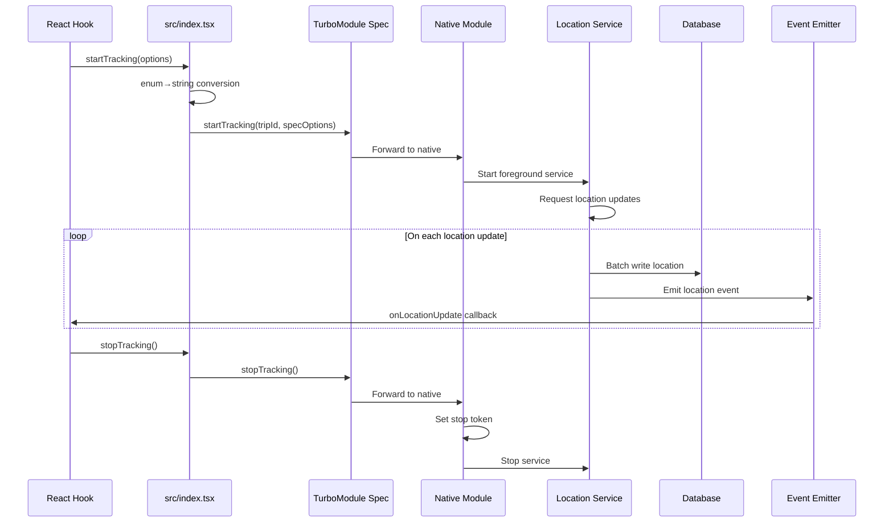

## Start Tracking Flow

When `startTracking()` is called, data crosses three boundaries before reaching the location provider.

### Step 1: TypeScript API (src/index.tsx)

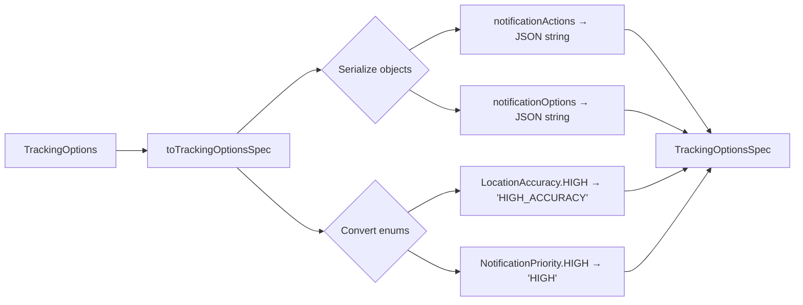

The `toTrackingOptionsSpec()` utility in `src/utils/trackingOptionsMapper.ts` handles two conversions that Codegen cannot:

1. **Enum-to-string** -- `LocationAccuracy` and `NotificationPriority` enum values become plain strings.
2. **Object-to-JSON** -- `notificationActions` (capped at 3 items) and `notificationOptions` are serialized to JSON strings.

### Step 2: TurboModule Bridge

The `TrackingOptionsSpec` interface crosses the bridge with all values in Codegen-compatible types (strings, numbers, booleans). The native side receives a `ReadableMap` (Android) or `NSDictionary` (iOS) and reconstructs the typed options.

### Step 3: Native Service Initialization

- **Android**: `BackgroundLocationModule` parses the `ReadableMap` into a Kotlin `TrackingOptions` data class, saves tracking state to Room DB, and starts `LocationService` as a foreground service.
- **iOS**: `BackgroundLocation.mm` forwards to `LocationManagerWrapper.swift`, which configures `CLLocationManager` with the mapped accuracy, distance filter, and background mode settings.

## Location Update Flow

Once tracking is active, location updates flow from the OS through the native layer and back to JavaScript.

### Android Event Pipeline

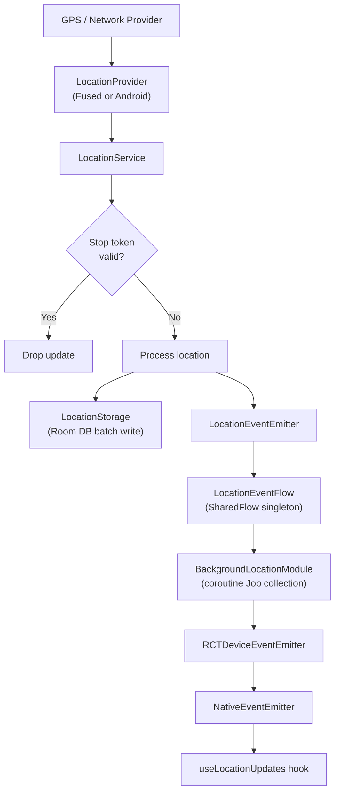

Android uses **SharedFlow singletons** to decouple event producers from consumers:

| SharedFlow | Sealed Interface | Producer | Consumer |
|------------|-----------------|----------|----------|
| `LocationEventFlow` | `LocationEvent` (Update, Error, Warning) | `LocationEventEmitter` | `BackgroundLocationModule` |
| `GeofenceEventFlow` | `GeofenceEvent` (Transition) | `GeofenceEventEmitter` | `BackgroundLocationModule` |
| `NotificationActionFlow` | `NotificationActionEvent` (ActionClicked) | `NotificationActionReceiver` | `BackgroundLocationModule` |

All three flows share the same configuration: `replay = 0`, `extraBufferCapacity = 64`, `onBufferOverflow = DROP_OLDEST`. The non-suspending `tryEmit()` API ensures producers never block.

`BackgroundLocationModule` collects from all three flows using coroutine Jobs scoped to `moduleScope` (SupervisorJob + Dispatchers.Main). Each collected event is forwarded to JavaScript via `RCTDeviceEventEmitter`.

### iOS Event Pipeline

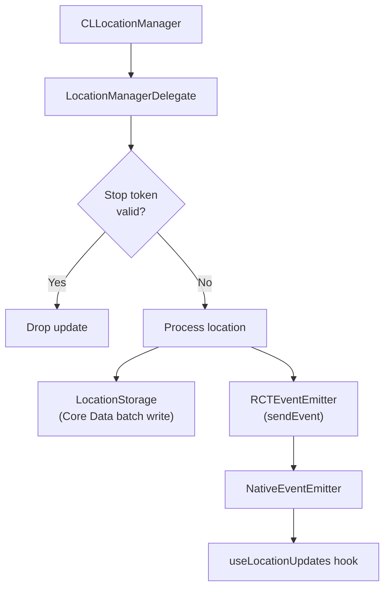

iOS uses **RCTEventEmitter** directly. `LocationManagerDelegate` processes each `CLLocation` from the `didUpdateLocations:` callback, writes to Core Data, and emits to JavaScript via `sendEvent(withName:body:)`. There is no intermediate flow layer -- the delegate bridges directly to the React Native event system.

### Platform Comparison

| Aspect | Android | iOS |
|--------|---------|-----|
| Event decoupling | SharedFlow singletons (3 flows) | Direct delegate-to-emitter |
| Buffer strategy | 64-element ring buffer, DROP_OLDEST | No buffer (immediate emit) |
| Thread model | Coroutine collection on Main dispatcher | Main thread delegate callbacks |
| Producer API | Non-suspending `tryEmit()` | Synchronous `sendEvent()` |
| Consumer lifecycle | Coroutine Jobs tied to `moduleScope` | RCTEventEmitter managed by React Native |

## Event Payload Format

Both platforms emit identical event payloads to JavaScript:

### onLocationUpdate

```typescript
{
  tripId: string;
  latitude: number;
  longitude: number;
  timestamp: number;
  accuracy?: number;
  altitude?: number;
  speed?: number;
  bearing?: number;
  verticalAccuracy?: number;
  speedAccuracy?: number;
  bearingAccuracy?: number;
  elapsedRealtimeNanos?: number;
  provider?: string;
  isMocked?: boolean;
}
```

### onLocationError

```typescript
{
  tripId: string;
  type: 'PERMISSION_REVOKED' | 'PROVIDER_ERROR';
  message: string;
}
```

### onLocationWarning

```typescript
{
  tripId: string;
  type: 'SERVICE_TIMEOUT' | 'TASK_REMOVED' | 'LOCATION_UNAVAILABLE';
  message: string;
}
```

### onNotificationAction

```typescript
{
  tripId: string;
  actionId: string;
}
```

## Storage Flow

### Write Path

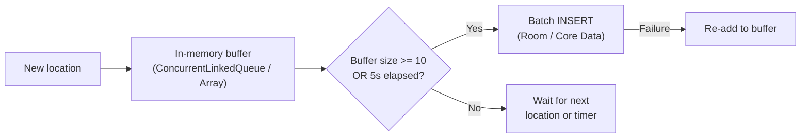

Both platforms use the same batching strategy:

- Locations are buffered in memory.
- Flush triggers when the buffer reaches **10 items** or a **5-second timer** fires.
- On flush failure, items are re-added to the buffer for retry.

### Read Path

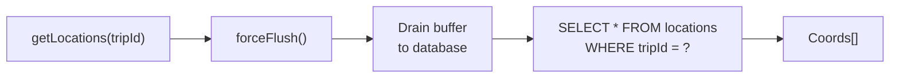

Every read operation calls `forceFlush()` first to drain pending writes, guaranteeing that the returned data includes the most recent buffered locations.

## Geofencing Data Flow

### Registration

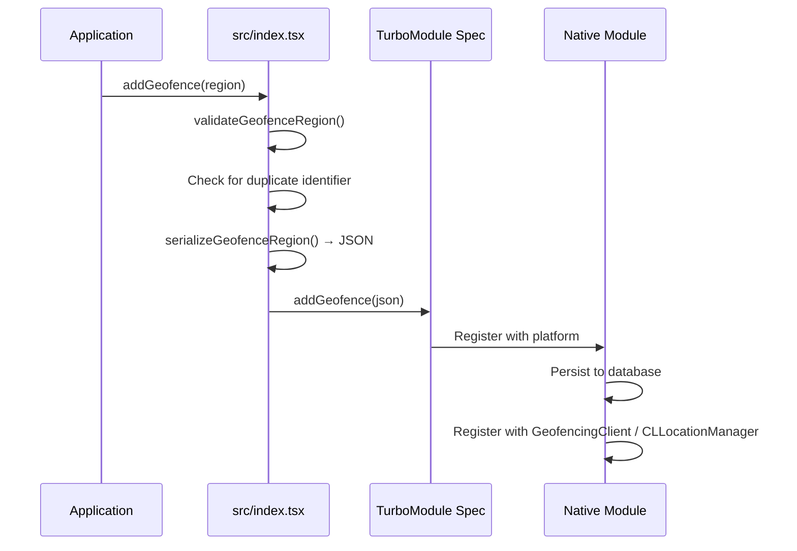

Geofence regions go through three transformations before reaching the platform:

1. **Validation** -- `validateGeofenceRegion()` checks identifier, radius, coordinates, and metadata.
2. **Duplicate check** -- Queries active geofences to prevent duplicate identifiers.
3. **Serialization** -- `serializeGeofenceRegion()` converts the typed `GeofenceRegion` to a JSON string for the bridge.

### Transition Events

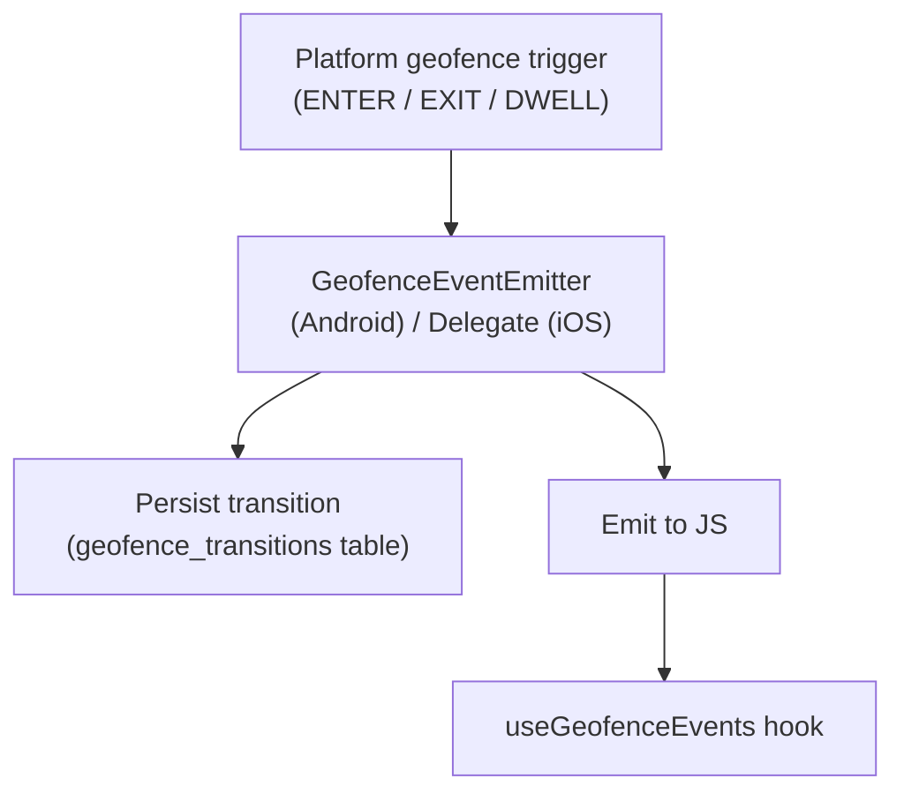

Transition events are both persisted (for later retrieval via `getGeofenceTransitions()`) and emitted in real-time to JavaScript.

## Stop Tracking Flow

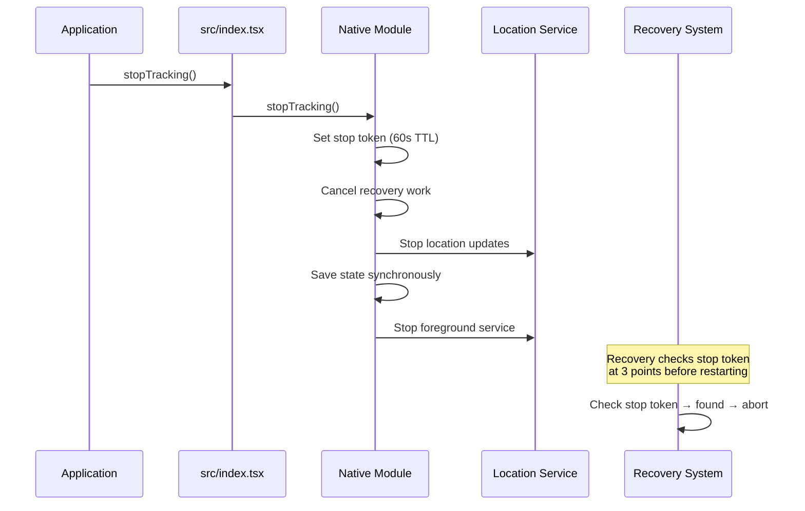

The stop token is the critical mechanism that prevents the recovery system from restarting a service that was intentionally stopped. It is set synchronously (`commit()` on Android, synchronous UserDefaults write on iOS) during `stopTracking()` and checked at three points in the recovery pipeline.

## Recovery Flow

### Android (WorkManager)

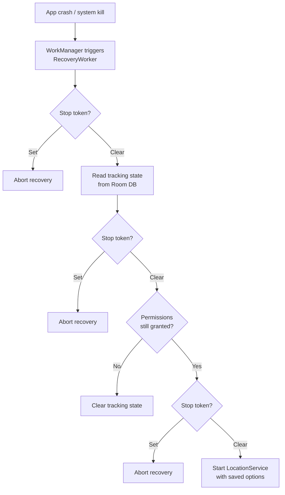

### iOS (Significant Location Monitoring)

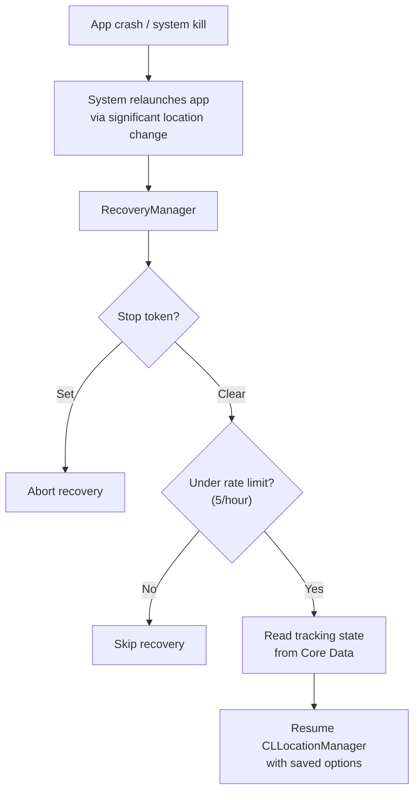

## Hook Data Flow

### useLocationUpdates

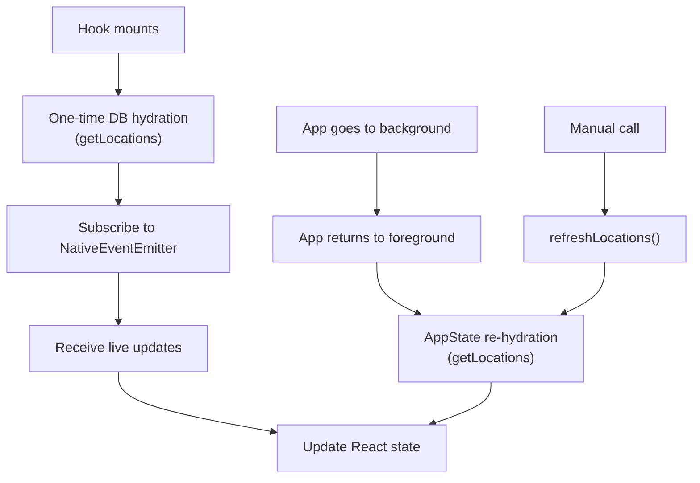

The hook uses three data sources:

1. **Mount hydration** -- One-time `getLocations()` call on mount to load persisted data.
2. **Live events** -- `NativeEventEmitter` subscription for real-time updates.
3. **Foreground re-hydration** -- `AppState` listener triggers `getLocations()` when the app returns from background, catching any updates that arrived while the JS bridge was inactive.

## Next Steps

- [Android Native Architecture](./android-native.md) -- Deep dive into SharedFlow, coroutines, and the foreground service.
- [iOS Native Architecture](./ios-native.md) -- Deep dive into CLLocationManager, Core Data, and the permission escalation flow.
